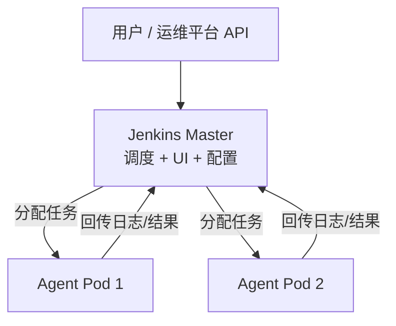
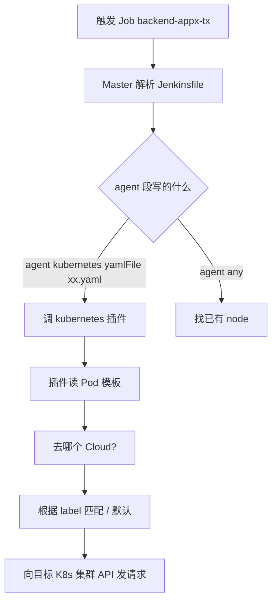
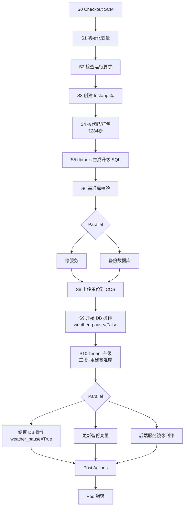
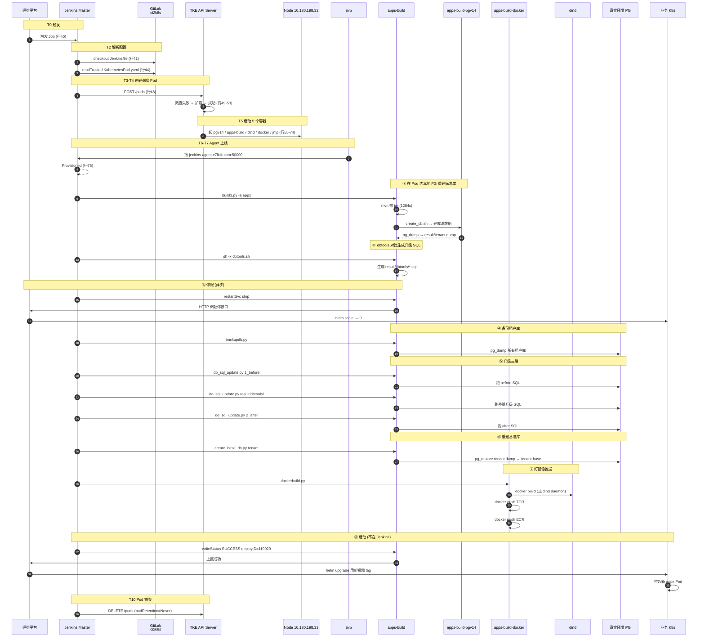

# Jenkins 工作原理详解（结合 Q7Link appx 部署日志）

> 配套：`jenkins2k8s-master/`（平台部署）、`app部署过程`（实际 Job 日志，#3946 backend-appx-tx → test-tx-23）
> 视角：从「Jenkins 是什么」到「一次构建在容器内每一秒发生什么」，所有结论都标日志行号可复核

---

## 文档分篇

| 篇章 | 阅读对象 | 内容 | 章节 |
|------|---------|------|------|
| **第一篇 平台篇** | 运维 / 平台同学 | Jenkins 是什么、Master/Agent 架构、jenkins2k8s 部署、JCasC、备份恢复、新集群接入 | 1 - 6 |
| **第二篇 原理篇** | 想搞清"任务怎么跑"的人 | Kubernetes Plugin、Agent 启动、Pipeline 引擎、容器协作、Remoting 协议 | 7 - 10 |
| **第三篇 实践篇** | 开发 / 流水线作者 | 12 Stage 全景、apps-build-steps.py Module 路由、9 个业务动作精确定位、启动服务边界 | 11 - 16 |

---

## 目录

### 第一篇 平台篇

- [1. Jenkins 是什么](#1-jenkins-是什么)
- [2. 核心架构：Master + Agent](#2-核心架构master--agent)
- [3. 五个核心概念](#3-五个核心概念)
- [4. 平台部署形态（jenkins2k8s）](#4-平台部署形态jenkins2k8s)
- [5. JCasC：Configuration as Code](#5-jcascconfiguration-as-code)
- [6. 备份恢复与新集群接入](#6-备份恢复与新集群接入)

### 第二篇 原理篇

- [7. Kubernetes Plugin：Agent 怎么来的](#7-kubernetes-pluginagent-怎么来的)
- [8. 一次构建的完整时间线 T0-T10](#8-一次构建的完整时间线-t0-t10)
- [9. T8 深拆：Pipeline 执行机制](#9-t8-深拆pipeline-执行机制)
- [10. 容器协作三板斧](#10-容器协作三板斧)

### 第三篇 实践篇

- [11. 12 个 Stage 全景对照表](#11-12-个-stage-全景对照表)
- [12. apps-build-steps.py Module 路由](#12-apps-build-stepspy-module-路由)
- [13. 业务动作精确定位](#13-业务动作精确定位)
- [14. 启动服务：Jenkins 不做](#14-启动服务jenkins-不做)
- [15. 完整时序图](#15-完整时序图)
- [16. 常见疑问对照表](#16-常见疑问对照表)

### 附录

- [附录 A：关键文件路径](#附录-a关键文件路径)
- [附录 B：关键术语](#附录-b关键术语)

---

# 第一篇 · 平台篇

## 1. Jenkins 是什么

Jenkins = **CI/CD 自动化服务器**。在 Q7Link 体系里主要承担 **构建 + 部署编排**。

可以理解为四个角色合一：

| 角色 | 职责 |
|------|------|
| 调度中心 | 接收触发指令，分配资源 |
| 执行编排器 | 按 Pipeline 定义依次执行 Stage |
| 资源管理器 | 决定任务在哪台机器/Pod 上跑 |
| 状态与日志中心 | 记录每次构建的成败、控制台输出 |

---

## 2. 核心架构：Master + Agent



| 角色 | 干什么 | 在 Q7Link 环境 |
|------|--------|-----------|
| **Master（Controller）** | Web UI、Job 配置、排队调度、凭证管理、插件加载 | `jenkins.e7link.com`，跑在 TKE `jenkins` namespace 的 StatefulSet |
| **Agent（Slave/Node）** | 真正执行 shell、maven、docker 等重活 | 每次构建动态起的 K8s Pod，跑完即销毁 |

**关键设计：Master 自己不跑构建**。`values.yaml` 与 JCasC 均配置 `numExecutors: 0`——所有构建都 offload 到 Agent Pod。这是 K8s 化 Jenkins 的标准做法。

---

## 3. 五个核心概念

### 3.1 Job（任务）

一个 Job = 一类可重复执行的工作单元。

常见类型：
- **Freestyle Job**：UI 点选配置，较老
- **Pipeline Job**：用 `Jenkinsfile` 写流水线（Q7Link 主要用这个）

例如 `backend-appx-tx` 就是一个 Job，每次触发产生一个 Build（如 #3946）。

### 3.2 Pipeline（流水线）

Pipeline 是用代码描述的多步骤工作流，写在 `Jenkinsfile` 里，语法是 Groovy。

```
Pipeline
  └── Stage（阶段）
        └── Step（步骤：sh、git checkout、并行等）
```

Pipeline 有两种来源：
- **Pipeline script**：直接写在 Jenkins UI 里
- **Pipeline from SCM**：从 Git 仓库读 `Jenkinsfile`（Q7Link 用这个，源码在 `ci2k8s`）

### 3.3 Plugin（插件）

Jenkins 本体很薄，能力靠插件扩展：

| 插件 | 作用 |
|------|------|
| **kubernetes** | 在 K8s 里动态创建 Agent Pod |
| **workflow / pipeline** | 支持 Pipeline 语法 |
| **git** | 从 Git 拉代码 |
| **credentials** | 管理密码、token、kubeconfig |
| **configuration-as-code (JCasC)** | 用 YAML 配置 Jenkins |

Q7Link 因网络原因，插件 **打进自定义镜像**，而不是启动时在线下载（Helm 里 `installPlugins` 被注释掉）。

### 3.4 Credential（凭证）

Jenkins 统一管理敏感信息：Git 密码、K8s token、AWS 密钥等。Pipeline 里通过 ID 引用，不硬编码。

JCasC 里 `kubernetes-prod` / `kubernetes-tke` 的 `credentialsId` 就是连各 K8s 集群用的凭证。

### 3.5 Workspace（工作目录）

每次构建在 Agent 上有一个工作目录，比如：

`/home/jenkins/agent/workspace/backend-appx-tx`

checkout 的代码、中间产物、脚本都在这里面。Pod 销毁后 emptyDir 会没，持久数据不在 workspace。

---

## 4. 平台部署形态（jenkins2k8s）

`jenkins2k8s-master` 仓库部署的是 **Jenkins 平台本身**，不是业务流水线。

```
jenkins2k8s-master/
├── jenkins/                          # 官方 Helm Chart 3.3.0 定制
│   ├── values.yaml                   # 镜像、资源、PVC、JCasC 开关
│   └── templates/                    # StatefulSet、Service、Ingress...
├── jenkins-jenkins-jcasc-config-tke.yaml   # K8s Cloud 配置
├── deploy.yaml                       # 定时备份 CronJob
├── jenkins-exporter-master/          # Prometheus 监控
└── demo/                             # kubernetes 插件 demo
```

部署方式：

```bash
helm upgrade --install jenkins --namespace=jenkins jenkins
```

| 项 | 值 |
|----|-----|
| Jenkins 版本 | 2.277.1-jdk11 |
| 部署形态 | Helm StatefulSet |
| 访问地址 | `http://jenkins.e7link.com` |
| Agent 隧道 | `jenkins-agent.e7link.com:50000` |
| 数据盘 | 200Gi PVC → `/var/jenkins_home` |
| Master 资源 | 5C / 22Gi |

`/var/jenkins_home` 里存的是 Jenkins 的「大脑」：
- Job 定义与构建历史
- 插件与全局配置
- 凭证（加密存储）
- 用户与权限

### 与 ci2k8s 的关系

```
┌─────────────────────────────────────────┐
│  jenkins2k8s（Jenkins 平台）              │
│  - Jenkins 服务怎么部署、跑在哪            │
│  - 连哪些 K8s 集群                       │
│  - 备份、监控、插件、凭证基础设施           │
└──────────────────┬──────────────────────┘
                   │ 提供运行环境
                   ▼
┌─────────────────────────────────────────┐
│  ci2k8s（Job 流水线定义）                 │
│  - 每个 Job 的 Jenkinsfile               │
│  - Agent Pod 长什么样（KubernetesPod.yaml）│
│  - 部署脚本                              │
└─────────────────────────────────────────┘
```

**jenkins2k8s = 工厂厂房和设备**
**ci2k8s = 各条生产线的工艺图纸**

---

## 5. JCasC：Configuration as Code

Jenkins 传统上在 Web UI 里点选配置，不好版本管理。**JCasC** 把配置写成 YAML，随 Git 管理。

Q7Link 的 `jenkins-jenkins-jcasc-config-tke.yaml` 定义了：

- 管理员账号策略
- **3 个 K8s Cloud**（连不同集群）

| Cloud 名 | 连哪个集群 | 用途 |
|----------|-----------|------|
| `kubernetes` | 本集群内 | Jenkins 自身 |
| `kubernetes-prod` | AWS EKS | AWS 环境的 Job |
| `kubernetes-tke` | 腾讯云 TKE | 腾讯云 Job（appx-tx 走这里） |

每个 Cloud 配置了 `serverUrl`、`credentialsId`、`jenkinsUrl`、`jenkinsTunnel` 等——Master 靠这些知道**去哪个集群起 Agent Pod**。

---

## 6. 备份恢复与新集群接入

### 6.1 备份

Jenkins 的配置和历史都在 PVC 里，丢了很麻烦。两层备份：

1. **容器内定时备份**：`/tmp/jenkinsbak_restore --mode=backup` → 上传 S3 `opsbucket/jenkinsbackup/`
2. **K8s CronJob**：每日凌晨 2:00 备份配置文件到 S3

### 6.2 灾难恢复

```bash
# 1. Helm 新建 Jenkins
helm upgrade --install jenkins --namespace=jenkins jenkins

# 2. 用最新 S3 备份恢复
/tmp/jenkinsbak_restore --mode=restore

# 3. UI: Manage Jenkins → Tools and Actions → Reload Configuration from Disk

# 4. 重启 StatefulSet
kubectl edit sts jenkins --namespace jenkins   # 副本改 0 → 保存 → 改 1 → 保存

# 5. 取新 admin 密码
kubectl exec --namespace jenkins -it svc/jenkins -c jenkins -- /bin/cat /run/secrets/chart-admin-password
```

### 6.3 新 K8s 集群接入流程

按 `readme.md`：

1. `ci2k8s/init/cloudsa.yaml` 在新集群创建 Jenkins ServiceAccount
2. `ci2k8s/init/init.sh` 取 SA token
3. Jenkins UI 创建 Secret Text 凭证（注意去掉结尾的 `%`）
4. UI 加新的 K8s Cloud 配置，测试连接通过
5. 更新 `jenkins2k8s/jenkins-jenkins-jcasc-config-tke.yaml` 同步配置
6. 新集群准备 NFS 卷给 Jenkins Job 用

---

# 第二篇 · 原理篇

## 7. Kubernetes Plugin：Agent 怎么来的

### 7.1 Master 怎么"找到"插件

不是 Master 主动去"找"插件。流程：

**Jenkins 启动时**：
1. Master 启动 → 扫描 `$JENKINS_HOME/plugins/*.hpi` → 全部加载到 JVM
2. kubernetes 插件加载后向 Jenkins 核心注册了一个扩展点：`org.csanchez.jenkins.plugins.kubernetes.KubernetesCloud`
3. JCasC 读 `jenkins-jenkins-jcasc-config-tke.yaml` 里的 `clouds:` 段 → 在 Master 内存里建出 3 个 `KubernetesCloud` 实例

**任务来了之后**：



Master 解析到 `Jenkinsfile` 里这段：

```groovy
agent {
  kubernetes {
    label 'mypod'
    yamlFile 'KubernetesPod.yaml'
  }
}
```

看到 `kubernetes { ... }` 这个关键字，**Pipeline 引擎直接把后续动作交给 kubernetes 插件**。

### 7.2 读 Pod 模板

kubernetes 插件拿到指令后：

1. 读 `yamlFile 'KubernetesPod.yaml'` → 从 SCM checkout 出来的 workspace 里读这个文件
2. 把 YAML 解析成一个 Pod 对象（就是标准 K8s Pod spec）
3. **插件会自动往这个 Pod 里注入一个 jnlp 容器**（如果你没写）——这就是 Agent 本体
4. 给 Pod 加上 label，用于稍后匹配

注入后实际创建的 Pod：

```
你写的 KubernetesPod.yaml      插件自动加的
┌─────────────────────┐       ┌──────────────┐
│ - apps-build-pgv14  │       │ - jnlp       │
│ - apps-build        │  +    │   (Agent本体) │
│ - dind              │       └──────────────┘
│ - apps-build-docker │
└─────────────────────┘
```

### 7.3 这个 Pod 是干嘛的

**这个 Pod = 一次构建的 Jenkins Agent**。

使命只有一个：**把这次构建的所有 Stage 跑完**。

- Pod 启动 → jnlp 容器连回 Master → Master 把它视为一台"临时虚拟机"
- Pipeline 里每一行 `sh '...'` 都是发给这个 Pod 执行
- 构建结束 → 默认 `podRetention: Never` → Pod 立即销毁

所以 Pod 是**一次性的、专属于这次 Build 的执行环境**。

---

## 8. 一次构建的完整时间线 T0-T10

以日志 `app部署过程`（Job `backend-appx-tx` #3946）为例：

```
T0  用户触发 Job
T1  Master 入队
T2  Master 解析 Jenkinsfile 的 agent 段
T3  kubernetes 插件向 K8s API 发 POST /pods
T4  K8s 调度 Pod 到某个 Node
T5  Pod 内所有容器并行启动
T6  jnlp 容器启动后，主动拨号回 Master:50000
T7  Master 收到连接 → Agent 上线 → 标记为 Online
T8  Master 把 Pipeline 步骤下发给 Agent 执行  ← 真正"开始构建"
T9  所有 Stage 跑完
T10 Pod 销毁
```

### 日志锚点表

| 步骤 | 行号 | 关键标记 |
|------|---------|---------|
| **T0** 触发 | 40 | `Started by user devops` |
| **T2** 解析 Jenkinsfile | 41 | `Obtained backend-appx-tx/Jenkinsfile from git` |
| **T2.1** 读 Pod 模板 | 44 | `Obtained backend-appx-tx/KubernetesPod.yaml from git` |
| **T2.2** Pipeline 进入 podTemplate | 45-47 | `[Pipeline] podTemplate` / `[Pipeline] node` |
| **T3** 向 K8s API 创建 Pod | 48 | `Created Pod: tke-ops jenkins/backend-appx-tx-3946-...` |
| **T4a** 调度失败/扩容 | 49-52 | `FailedScheduling` → `TriggeredScaleUp` → `Scheduled` |
| **T4b** Agent 等待中 | 51 | `'backend-appx-tx-3946-...' is offline` |
| **T5** 5 个容器依次启动 | 55-74 | 5 组 `Pulling`→`Pulled`→`Created`→`Started` |
| **T6-T7** Agent 上线 | 76 | `Agent backend-appx-... is provisioned from template` |
| **T8 开始** Pipeline 下发到 Agent | 245 | `Running on backend-appx-... in /home/jenkins/agent/workspace/...` |
| **T8 首次 container 切换** | 283-307 | `[Pipeline] container` + `[Pipeline] sh` 在 `apps-build` |
| **T9** 12 个 Stage 全跑完 | 4105-4170 | `[Pipeline] { (Declarative: Post Actions)` |
| **T10** Pod 销毁 | 末尾 | （podRetention: Never 由 K8s 自动 delete） |

### 关键节点详解

#### T2 - Master 解析 Jenkinsfile

```
行 41: Obtained backend-appx-tx/Jenkinsfile from git http://gitlab.../ops/ci2k8s.git
行 44: Obtained backend-appx-tx/KubernetesPod.yaml from git
```

两次 `Obtained ... from git`：

- 第一次拿 **Jenkinsfile** ← Master 拿来解析"这个 Job 怎么跑"
- 第二次拿 **KubernetesPod.yaml** ← `readTrusted` 把 Pod 模板从 Git 读出来

**这两次都发生在 Master 上**。此时 Agent Pod 还没创建，Master 用自己的 git 客户端短暂 checkout `ci2k8s` 拿配置文件。

#### T4 - K8s 调度（含戏剧性的扩容）

```
行 49: [Warning][FailedScheduling] 0/6 nodes are available: ... Insufficient cpu ...
行 50: Still waiting to schedule task
行 51: 'backend-appx-tx-3946-...' is offline
行 52: [Normal][TriggeredScaleUp] pod triggered scale-up: [{asg-ip9ebam1 3->4 (max: 30)}]
行 53: [Normal][Scheduled] Successfully assigned ... to 10.120.198.33
```

1. 6 个 Node 都没空 CPU → 调度失败
2. Master 看到 Agent **offline**（这就是为什么 T8 还没开始）
3. 触发 cluster-autoscaler，自动扩容节点组 `asg-ip9ebam1` 从 3 → 4
4. 新节点起来后，Pod 被调度到 `10.120.198.33`

**所以日志里"等了一会儿"的真实原因——不是 Jenkins 慢，是 K8s 在扩容节点**。

#### T5 - 5 个容器依次启动

| # | 容器名 | 镜像 | 用途 |
|---|--------|------|------|
| 1 | `apps-build-pgv14` | `ops/pg:v14` | Pod 内本地 PG（localhost:5432） |
| 2 | `apps-build` | `apps_build:sqlite-334-pg14-1` | Maven + Python 主干 |
| 3 | `dind` | `docker:stable-dind` | Pod 内 Docker daemon |
| 4 | `apps-build-docker` | `k8sdockerpush:2` | docker push 到 TCR/ECR |
| 5 | `jnlp` | `inbound-agent:4.6-1` | **Jenkins Agent 本体** |

日志看起来像串行，其实是 kubelet 按 Pod spec 顺序拉镜像，但容器一旦 Started 就开始运行。前 4 个容器都是 `command: ["cat"]` 待命，只有 jnlp 启动后会主动连 Master。

#### T6-T7 - jnlp 连回 Master，Agent 上线

```
行 76: Agent backend-appx-tx-3946-... is provisioned from template backend-appx-tx_3946-7ddvq-nnn9w
行 77-244: ---  (整个 Pod spec 的完整 yaml dump)
```

**这一行是分水岭**。背后发生的事：

1. jnlp 容器内的 `java -jar remoting.jar` 启动
2. 读环境变量 `JENKINS_URL=http://jenkins.jenkins.svc.cluster.local:8080/`
3. 拨号到 `jenkins-agent.e7link.com:50000`（注意：jnlp 在 TKE 集群里，走外网/隧道）
4. 用 `${computer.jnlpmac}` 密钥认证
5. 长 TCP 连接建立 → Master 标记 Online

**Agent ≠ Pod 一启动就有；Agent = jnlp 容器主动连上 Master 那一刻才算"启动成功"**。

---

## 9. T8 深拆：Pipeline 执行机制

### 9.1 一个关键认知纠正

```
错误模型              正确模型
─────────────         ────────────────
Master                Master
  └─ Agent              └─ Pod (K8s 一次性建出来)
       └─ 创建 maven 容器     ├─ jnlp 容器 (这才是 Agent)
       └─ 创建 docker 容器    ├─ maven 容器
                              ├─ docker 容器
                              └─ ...
```

**所有容器是 K8s API Server 在 T3 一次性创建的兄弟关系**。jnlp 不是 maven 的爹，它俩是同 Pod 里的同级容器，共享 Network/Volume。

### 9.2 T8 内部 10 步

```
T8.1  Master Pipeline 引擎从队列拿出第一个 Stage
T8.2  引擎遇到 container('maven') 块
T8.3  Master 通过 Remoting 通道向 jnlp 下发 "ContainerExecDecorator" 指令
T8.4  jnlp 容器收到指令，调用 K8s API: POST /exec?container=maven
T8.5  K8s API Server 转给 kubelet → kubelet 在 maven 容器里 fork 出 sh 进程
T8.6  sh 进程开始执行 "mvn -version"
T8.7  stdout/stderr 通过 WebSocket 流回 jnlp
T8.8  jnlp 通过 Remoting 流回 Master
T8.9  Master 写入构建日志 + 实时刷到 Console Output UI
T8.10 sh 进程退出 → 退出码回传 → Pipeline 引擎判断成败 → 走下一步
```

### 9.3 jnlp 与 Master 通信协议

**协议名**：Jenkins Remoting（基于 TCP 长连接）

- `inbound-agent:4.6-1` 镜像里是一个 Java 程序：`remoting.jar`
- 启动时拨号到 `jenkins-agent:50000`（JCasC 里的 `jenkinsTunnel`）
- 用 `${computer.jnlpmac}` 作为身份密钥认证

连上之后这条 **TCP 长连接一直保持**，Master 想让 Agent 干啥就通过这条管道发"指令对象"过去（Java 对象序列化）。

### 9.4 jnlp 怎么把命令丢进别的容器

每个工具容器的 `command: ["cat"]` —— **不是真的让它跑 cat**，是占住进程让容器"活着待命"（cat 在 tty 下会阻塞等待输入，永不退出）。

当 Pipeline 写 `container('maven') { sh 'mvn -version' }`：

```
Master                     jnlp 容器                K8s API Server         maven 容器
  │                          │                         │                     │
  │  "在 maven 跑 mvn -v"   │                         │                     │
  ├─────────────────────────▶│                         │                     │
  │                          │  POST /api/v1/.../exec  │                     │
  │                          │  ?container=maven       │                     │
  │                          │  &command=sh -c "mvn -v"│                     │
  │                          ├────────────────────────▶│                     │
  │                          │                         │  exec into pid 1's  │
  │                          │                         │  namespace → fork   │
  │                          │                         ├────────────────────▶│
  │                          │                         │                     │ sh 跑 mvn
  │                          │                         │   stdout 流         │
  │                          │                         │◀────────────────────┤
  │                          │   WebSocket 流回        │                     │
  │                          │◀────────────────────────┤                     │
  │   Remoting 流回           │                         │                     │
  │◀─────────────────────────┤                         │                     │
  │ 写日志 + 刷 UI            │                         │                     │
```

底层等价于：

```bash
kubectl exec -it <pod-name> -c maven -- sh -c "mvn -version"
```

只不过这个动作是 jnlp 容器**用 Pod 自带的 ServiceAccount token 自动发的**。

> **jnlp 为什么有权限 exec 别的容器？**
> 因为 Pod 是用 `serviceAccount: "default"` 起的，这个 SA 在 jenkins namespace 有 RBAC 权限（`readme.md` 提到「新集群接入要用 `init/cloudsa.yaml` 创建 SA」）。

### 9.5 Pipeline 引擎在哪运行

很多人以为 Pipeline 逻辑在 Agent 上跑。**错**。

```
Pipeline 引擎  ──→  跑在 Master JVM 里
sh '...'      ──→  实际命令在 Agent 容器里跑
```

Master 把 Groovy 脚本一行行解释，遇到 `sh`、`container`、`stage` 这些指令时，**通过 Remoting 通道发对应任务到 Agent**。

所以 Pipeline 写得复杂，Master 会重；脚本里多塞 `sh` 命令，Agent 才忙。

---

## 10. 容器协作三板斧

容器之间**不直接通信**。所谓"协作"靠三个共享机制：

### 10.1 共享 Volume（传文件）

`KubernetesPod.yaml` 里 `cache-volume` 是 `emptyDir`，多个容器都挂同一目录：

```yaml
- name: cache-volume
  emptyDir: {}
```

```yaml
volumeMounts:
  - mountPath: "/data/cache"
    name: cache-volume
```

Pipeline 引擎按 Stage 顺序串行调度：

```
Stage 1: container('maven')
   → exec 进 maven 容器 → 写文件到 /data/cache/xxx.txt
   ↓
Stage 2: container('busybox')
   → exec 进 busybox 容器 → 读 /data/cache/xxx.txt
```

第二个容器能读到第一个容器写的文件，本质是**两个容器看到的是同一块磁盘**（emptyDir 在 Node 上是同一个目录）。

### 10.2 共享 Network namespace（localhost 互通）

Pod 里所有容器**共用一个网络命名空间**。如果 Pod 里有个 PG 容器（如 `apps-build-pgv14`），其他容器连 `localhost:5432` 就能连上 PG，根本不用 Service。

日志佐证（行 478）：

```
+ PGPASSWORD=123 createdb testapp -h localhost -p 5432 -U postgres
```

### 10.3 共享 Workspace（前后容器接力）

所有容器都挂载 `workspace-volume` 到 `/home/jenkins/agent/workspace/backend-appx-tx`。

- `apps-build` 容器打的 jar 在 `/home/jenkins/agent/workspace/.../result/`
- 切到 `apps-build-docker` 容器，看到的还是 **同一个 workspace 目录**
- `docker build` 直接 `COPY result/*.jar` 进镜像

### 10.4 关于"并行"

日志里 `[Pipeline] parallel`（行 2899, 3331）出现的并行是 **Pipeline 引擎层面的并行**：

- 还是同一个 Pod
- 还是同一个 jnlp
- Master 端开多线程，同时对 jnlp 发多条 exec 指令
- jnlp 对 K8s API 发多个并发 exec 请求

**"并行" ≠ "多个 Pod"**，仍是单 Pod 单 Agent。

---

# 第三篇 · 实践篇

## 11. 12 个 Stage 全景对照表

按日志中 `[Pipeline] { (...)` 的真实顺序梳理 backend-appx-tx #3946 的全部 12 个 Stage：

| # | Stage 名 | 行号范围 | 容器 | 关键动作 | 调用脚本/工具 |
|---|---------|---------|------|---------|--------------|
| 0 | Declarative: Checkout SCM | 247-269 | `jnlp` | checkout `ci2k8s` 到 workspace | `git clone` |
| 1 | 初始化变量 | 281-309 | `apps-build` | 判断是否构建 appx；拿目标环境 PG 配置 | `getAppx` / `getDbConfig` |
| 2 | 检查是否满足运行要求 | 310-470 | `apps-build` | 互斥锁检查；注入临时 DB 信息 | `checkTask` / `insertDbinfo` |
| 3 | 创建 testapp 数据库 | 471-482 | `apps-build` | 在 Pod 内 PG 建临时 testapp 库 | `createdb -h localhost` |
| 4 | 拉取代码/打包 | 483-2830 | `apps-build` | **核心**：拉 build.git，跑 build3.py 编 jar + 灌临时库 + 出 dump | `build3.py -a appx` |
| 5 | 后台服务数据库升级脚本制作 | 2831-2865 | `apps-build` | dbtools 对比临时库 vs 环境基准库 → 生成差量 SQL | `dbtools.sh` + `genUpgradeScript` |
| 6 | 基准库校验-应用 api-buildtime | 2866-2898 | `apps-build` | 校验环境基准库 buildtime 与本次匹配 | `check_db_buildtime.py` |
| 7 | 停服务/备份数据库（并行） | 2899-2979 | `apps-build` | 并行：调运维 API 停服务 + pg_dump 全部租户库 | `restartSvc stop` + `backupdb.py` |
| 8 | 上传数据库备份到 cos | 2980-3015 | `apps-build` | 压缩 + 上传备份到对象存储 | `uploadToCos` |
| 9 | 开始数据库操作（terminate=False） | 3016-3028 | `apps-build` | 通知运维平台"开始升级，期间不允许中断" | `updateWeatherPause=False` |
| 10 | **Tenant 库升级 + 基准库创建** | 3029-3330 | `apps-build` | **三段升级 + 重建基准库**（核心） | `do_sql_update.py` × 3 + `create_base_db.py` |
| 11 | 并行：打镜像 / 更新备份变量 / 结束 DB 操作 | 3331-4104 | `apps-build-docker` + `apps-build` | 并行三路：打 docker 镜像推 TCR/ECR / 备份变量 / 通知运维可中断 | `dockerbuild.py` + `updateWeatherPause=True` |
| Post | Declarative: Post Actions | 4105-4170 | `apps-build` | 上报 SUCCESS；上传产物到 COS | `writeStatus SUCCESS` + `uploadToCos` × N |

### 11.1 Stage 时长分布（部分关键 Stage）

| Stage | 大概耗时 | 大头在哪 |
|-------|---------|---------|
| Stage 4 拉取代码/打包 | **1284 秒** | mvn 从 Nexus 下载所有 jar |
| Stage 5 dbtools 生成升级脚本 | ~30 秒 | java 跑 dbtools.jar 比对 |
| Stage 7 备份数据库 | ~80 秒 | pg_dump 5+ 个租户库 |
| Stage 10 Tenant 库升级 | ~300 秒 | 5 个租户并行跑三段 SQL |
| Stage 11 后端服务镜像制作 | ~700 秒 | docker build + push TCR + push ECR |

### 11.2 Stage 串/并关系图



---

## 12. apps-build-steps.py Module 路由

### 12.1 设计思想

`apps-build-steps.py` 是 ci2k8s 仓库里的 **单一脚本入口**，通过 `--Module=xxx` 路由到不同子功能。这是 Q7Link CI 体系的关键设计：

```
                    apps-build-steps.py
                            │
        ┌───────────────────┼───────────────────┐
        ▼                   ▼                   ▼
   环境探测类           运维平台对接类         产物搬运类
   (getXxx)            (restartSvc等)        (uploadToCos)
```

**为什么这么做**：

- 单脚本统一管理 Job ↔ 运维平台的所有交互
- Jenkinsfile 只写 `sh "python ... --Module=xxx"`，Stage 名和 Module 名对得上
- 易扩展：新功能加个 Module 分支，不影响其他

### 12.2 完整 Module 路由表（基于日志反推）

| Module | 用途 | 典型调用 | 在哪个 Stage | 日志行号 |
|--------|------|---------|-------------|---------|
| `getAppx` | 判断当前 Job 是否需要构建 appx 服务 | `--Env=test-tx-23` | S1 初始化变量 | 291 |
| `getDbConfig` | 拉取目标环境的 PG 连接配置 JSON | `--Env=test-tx-23` | S1 初始化变量 | 295 |
| `checkTask` | **互斥锁**：检查环境有没有正在运行的部署任务 | `--Env=xxx --Branch=xxx` | S2 检查运行要求 | 319 |
| `insertDbinfo` | 向 db-config.json 注入本次构建用的临时 DB 信息 | `--DBfiles=xxx --DBName=xxx --DBHost=localhost` | S2 检查运行要求 | 324 |
| `callbackLog` | 回调运维平台 deployID 写日志（前端可见进度） | `--deployID=xxx --log_info=xxx` | 每个 Stage 开头 | 488 |
| `getBuildPort` | 获取服务端口配置（appx=8800 等） | `--Env=xxx` | S5/S6 | 2414, 2861 |
| `genUpgradeScript` | 触发 dbtools 生成升级脚本 | `--DbtoolsPath=xxx --BUILD_DB_NAME=xxx` | S5 升级脚本制作 | 2838 |
| `restartSvc` | **关键**：调运维平台 API 停/启业务服务 | `--Svclist=appx,trek --Operate=stop\|start` | S7 停服务 | 2922 |
| `uploadToCos` | 上传任意目录到对象存储（备份/产物） | `--localPath=xxx --cosfilePath=xxx [--isSubCompress=True]` | S8/Post | 2987, 4128-4138 |
| `updateWeatherPause` | 标记部署任务能否被中断（开始/结束 DB 操作） | `--deployID=xxx --weather_pause=True\|False` | S9/S11a | 3023, 3353 |
| `uploadDbScriptToCos` | 专门上传 DB 升级脚本到 COS（脚本归档） | `--localPath=xxx --cosfilePath=xxx` | S10 内部 | 3285, 3291, 3302 |
| `writeStatus` | **结束信号**：写最终任务状态 SUCCESS/FAILURE | `--taskStatus=SUCCESS --deployID=xxx --buildID=xxx --buildTime=xxx` | Post Actions | 4124 |

### 12.3 Module 分类

```
┌─ 环境探测类（构建期使用）
│   ├─ getAppx               判断要构建哪些服务
│   ├─ getDbConfig           拿目标环境 PG 配置
│   └─ getBuildPort          拿服务端口配置
│
├─ 互斥与状态类（与运维平台交互）
│   ├─ checkTask             环境互斥锁
│   ├─ insertDbinfo          注入临时 DB 信息
│   ├─ callbackLog           进度日志回调
│   ├─ updateWeatherPause    标记 DB 操作中
│   └─ writeStatus           最终状态
│
├─ 业务动作类（触发实际工作）
│   ├─ genUpgradeScript      触发 dbtools 生成升级 SQL
│   └─ restartSvc            停/启服务（HTTP 调 helm）
│
└─ 产物搬运类（与对象存储交互）
    ├─ uploadToCos           通用上传
    └─ uploadDbScriptToCos   DB 脚本上传
```

### 12.4 关键认知：Jenkins ↔ 运维平台是 HTTP 关系

`restartSvc` / `updateWeatherPause` / `writeStatus` 等模块本质都是 **HTTP 调用运维平台 API**。

例如行 2925：

```
调用起停接口成功:{'code': 0, 'msg': '创建部署任务成功', 'count': 0, 'data': {}, 'taskid': 378520}
```

`taskid: 378520` 是运维平台的子任务 ID——Jenkins 只是"下单"，真正执行 helm 操作的是运维平台。

---

## 13. 业务动作精确定位

把 appx 部署的 9 件事用日志精确定位到 **容器 / Stage / 行号 / 命令**：

| # | 业务动作 | 容器 | Stage | 行号 | 关键命令 |
|---|---------|------|-------|------|---------|
| 1 | 拉 Maven jar / 编译 | `apps-build` | 拉取代码/打包 | 565 | `python3 -u build3.py -a appx` |
| 2 | 建临时库 + 导入数据 + 出 dump | `apps-build`（连 `apps-build-pgv14`） | 同上（build3 内部） | 2239-2242 | `bash create_db.sh -d tenant ...` |
| 3 | dbtools 对比基准库生成差量 SQL | `apps-build` | 后台服务数据库升级脚本制作 | 2246-2864 | `sh -x dbtools.sh` + `java -jar dbtools.jar` |
| 4 | 停业务服务 | `apps-build` | 停止环境服务 | 2922 | `apps-build-steps.py --Module=restartSvc --Operate=stop` |
| 5 | 备份环境租户库 | `apps-build` | 备份数据库 | 2931 | `backupdb.py` |
| 6a | 升级环境租户库 第①段 before | `apps-build` | Tenant库升级 | 3038 | `do_sql_update.py upgrade/1_before` |
| 6b | 升级环境租户库 第②段 dbtools diff | `apps-build` | Tenant库升级 | 3116 | `do_sql_update.py result/dbtools/` |
| 6c | 升级环境租户库 第③段 after | `apps-build` | Tenant库升级 | 3211 | `do_sql_update.py upgrade/2_after` |
| 7 | 重建 tenant-base 基准库 | `apps-build` | Tenant基准库创建 | 3316-3322 | `create_base_db.py` → `create_db.sh ... -b tenant.dump` |
| 8 | 打业务镜像 + 推 TCR/ECR | **`apps-build-docker`** | 后端服务镜像制作 | 3509-3980 | `dockerbuild.py` → `docker build` + `docker push` ×2 |
| 9 | **启动服务** | **不在 Jenkins** | — | — | 异步回调运维平台，由 helm 拉起 |

### 13.1 拉 jar / 编译（apps-build 容器）

行 565 进入 `build3.py`：

```
+ export JAVA_TOOL_OPTIONS=-Dfile.encoding=UTF-8
+ python3 -u build3.py -a appx
```

`build3.py` 内部做的事（输出在行 566-2245，跑了 1284 秒）：
- 读 `config.yaml` 解析版本清单
- 跑 `mvn copy/unpack` 把所有依赖 jar 从 Nexus 拉下来
- 生成 db_status.json、syncmeta.xml

### 13.2 建临时库 + 导入数据 + 出 dump

行 2238-2241，仍在 `build3.py` 内部：

```
create tenant.dump ...
执行: bash create_db.sh -d tenant -a "..." -c "base biz inv" -s tenant -b result/tenant.dump
create identity.dump ...
执行: bash create_db.sh -d identity -a "identity" -s identity -b result/identity.dump
```

关键：
- `create_db.sh` 在 **`apps-build` 容器**里跑（因为是 `build3.py` 调起的子进程）
- 但 `create_db.sh` 内部连的是 `localhost:5432` → **连到同 Pod 的 `apps-build-pgv14` 容器**（共享 Network namespace）
- 在那个临时 PG 里**重建一份新版本的标准库**，再 `pg_dump` 成 `result/tenant.dump` / `result/identity.dump`

**这就是为什么 Pod 里要有 PG 容器**——用来跑一次性的"标准库"，避免污染真实环境数据库。

### 13.3 dbtools 对比生成升级 SQL

行 2246 进入 dbtools.sh，Stage `后台服务数据库升级脚本制作`：

```
+ sh -x dbtools.sh
+ mkdir -p result/dbtools
+ mvn ... -Dartifact=com.q7link.application:dbtools:1.3.0-SNAPSHOT
+ java -jar -XX:+UseContainerSupport -XX:MaxRAMPercentage=80.0 -Xss4m dbtools-1.3.0-SNAPSHOT.jar $*
```

dbtools 跑出来的差量 SQL 落地到 `apps_src/result/dbtools/`，文件名形如：

```
apps-build_test-tx-23_feature-budget-customize_3946_..._to_test-tx-23.tenantallin-base.sql
```

意思：**"我刚建的临时库" 对比 "环境的基准库" → 生成升级到目标版本所需 SQL**。

### 13.4 停业务服务

行 2922，Stage `停止环境服务`：

```
+ python -u backend-appx-tx/scripts/apps-build-steps.py --Module=restartSvc --Env=test-tx-23 --Svclist=bpmn-bridge,bpmn-server,appx,trek --Operate=stop
调用起停接口成功:{'code': 0, 'msg': '创建部署任务成功', 'count': 0, 'data': {}, 'taskid': 378520}
```

**Jenkins 自己不直接停 K8s Deployment**。它调 `restartSvc` 模块，脚本内部 **HTTP 调运维平台 API**（返回 `taskid: 378520`），由运维平台执行 `helm` 把服务缩到 0。

### 13.5 备份租户库（并行于停服）

行 2931，并行 Stage `备份数据库`：

```
+ python -u backend-build-image-tx/scripts/backupdb.py postgres.test-tx-23.e7link.com-db-config.json test-tx-23 /data/database_backup/backend-appx-tx 3946 backup 20251027121055 119929
```

`backupdb.py` 连 **真实环境 PG**（`postgres.test-tx-23.e7link.com`，不是 localhost），执行 `pg_dump` 把所有租户库备份到 `/data/database_backup/backend-appx-tx/`（EFS PVC）。

### 13.6 升级租户库（三段）

Stage `Tenant库数据库升级/基准库创建`，三次 `do_sql_update.py`：

**第①段 - before 预处理**（行 3038）：跑 `upgrade/1_before/` 下的手工 SQL，对每个租户库**并行**执行。

**第②段 - dbtools diff 主升级**（行 3116）：跑步骤 3 产出的 dbtools 差量 SQL，把环境租户库**结构和基础数据**升级到新版本。

**第③段 - after 后处理**（行 3211）：跑 `upgrade/2_after/` 下的升级后数据修复 SQL。

### 13.7 重建 tenant-base 基准库

行 3316-3322：

```
+ python -u backend-build-image-tx/scripts/create_base_db.py postgres.test-tx-23.e7link.com-db-config.json test-tx-23 ... tenant
cd .../scripts && sh create_db.sh -u postgres -s xxx -h postgres.test-tx-23.e7link.com -d tenant-base -b .../result/tenant.dump -m 3
重建基准库成功
```

**用步骤 2 产出的 `tenant.dump`，pg_restore 到环境的 `tenant-base` 库**。这样下次比对时，环境的"基准"就和这次发布的版本一致了——闭环。

### 13.8 打镜像 + 推到镜像仓库

第一次切到 `apps-build-docker` 容器（行 3354）：

```
+ bash cloud_repository_auth.sh ecr_tcr_auth
Login Succeeded
Login Succeeded
```

先 `cloud_repository_auth.sh` 同时登录 **TCR（腾讯云）** 和 **AWS ECR**。

```
+ python3 -u backend-appx-tx/scripts/dockerbuild.py dockerbuild_port.json 20251027121055 feature-budget-customize_test-tx-23-3946 false test-tx-23 appx 119929
```

`dockerbuild.py` 干的事：

1. 从 `dockerbuild_port.json` 读 appx 的端口配置（8800）
2. 拷 `Dockerfile` 模板，做参数替换
3. 执行 `docker build`（行 3526）
4. 推到 **TCR**（行 3818）
5. 重新打 tag 推到 **AWS ECR**（行 3980）

**两个仓库都推**：TCR 给 TKE 集群拉，ECR 给 AWS 集群拉。

**`docker build` 怎么真的执行？**
`apps-build-docker` 容器里只装了 docker CLI，没有 daemon。它通过 `DOCKER_HOST` 或共享 socket 把命令发给同 Pod 的 `dind` 容器，由 dind 真正构建。这就是 Pod 里第 3 个容器 `dind` 的用处。

---

## 14. 启动服务：Jenkins 不做

整份日志里**没有一句 "启动服务" 的 log**。

启动是通过两个间接信号让运维平台自己起：

**信号 A**：镜像推到仓库（运维平台监听）
**信号 B**：updateWeatherPause + 回调 deployID 状态

```
行 3353: + python -u backend-appx-tx/scripts/apps-build-steps.py --Module=updateWeatherPause --Env=test-tx-23 --deployID=119929 --weather_pause=True
行 3365: 更新119929成功, 状态True
行 4124: + python -u backend-appx-tx/scripts/apps-build-steps.py --Module=writeStatus --Env=test-tx-23 --taskStatus=SUCCESS --deployID=119929 --buildID=3946 --buildTime=20251027121055
```

**Jenkins 的责任在 `writeStatus SUCCESS` 那一刻就结束了**。

运维平台（QiQiOps）那边监测到 deployID 119929 成功 → 用最新镜像 tag → 执行 `helm upgrade appx ...` → K8s 拉起新 Pod。这部分不在 Jenkins 日志里。

### 14.1 Jenkins ↔ 运维平台的责任分工

| 责任 | Jenkins | 运维平台 |
|------|---------|----------|
| 构建 jar / 打镜像 | ✅ | ❌ |
| 推送镜像到 TCR/ECR | ✅ | ❌ |
| 数据库备份 / 升级 / 重建基准库 | ✅ | ❌ |
| 触发停服务 | ✅（通过 API） | ❌ |
| 实际执行 helm scale=0 | ❌ | ✅ |
| 业务服务拉起（helm upgrade） | ❌ | ✅ |
| 健康检查 / 流量切换 | ❌ | ✅ |
| 部署进度展示给用户 | ❌ | ✅（通过 callbackLog 回的数据） |

---

## 15. 完整时序图



---

## 16. 常见疑问对照表

| 疑问 | 答案 |
|------|------|
| Master 怎么找到 kubernetes 插件 | 启动时插件已注册；Jenkinsfile 里写 `agent kubernetes` 触发使用 |
| Pod 模板从哪读 | Master 用 `readTrusted` 从 Git 读 `KubernetesPod.yaml` |
| 创建什么 | 一个 K8s **Pod**（不是 Job/Deployment），临时的 |
| Agent 何时启动 | jnlp 容器拨号成功的那一刻（行 76） |
| 是 Agent 创建容器吗 | **不是**，K8s kubelet 在 T5 就把所有容器全建好了 |
| 为什么多个容器 | 每个工具一个容器（PG/Maven/Docker），按 Stage 切换 |
| 容器怎么协作 | 共享 Volume（workspace、cache-volume）+ 共享 Network（localhost） |
| 真正"开始构建" | `Running on ... in /home/jenkins/agent/workspace/...`（行 245） |
| 业务镜像谁拉起 | **不是 Jenkins**，是运维平台用 helm 拉起 |
| Jenkins 的责任边界 | 从触发到 `writeStatus SUCCESS` 为止 |
| `[Pipeline] parallel` 是多 Pod 吗 | 不是，仍是单 Pod 单 Agent，只是 Master 多线程发 exec |
| 没写 `container('xxx')` 时 sh 在哪跑 | 默认在 jnlp 容器（jnlp 镜像自带 git 等基础工具） |
| 容器 `command: ["cat"]` 是干嘛 | 占住进程让容器"活着待命"，等 jnlp exec 命令进来 |

---

# 附录

## 附录 A：关键文件路径

### 平台层（jenkins2k8s 仓库）

| 文件 | 作用 |
|------|------|
| `jenkins2k8s-master/jenkins/values.yaml` | Helm values：镜像、资源、PVC |
| `jenkins2k8s-master/jenkins-jenkins-jcasc-config-tke.yaml` | JCasC 配置：K8s Cloud 定义 |
| `jenkins2k8s-master/readme.md` | 平台运维：备份/恢复/新集群接入 |
| `jenkins2k8s-master/deploy.yaml` | CronJob：定时备份 |
| `jenkins2k8s-master/jenkins-exporter-master/` | Prometheus 监控 |

### 编排层（ci2k8s 仓库）

| 文件 | 作用 |
|------|------|
| `ci2k8s/backend-appx-tx/Jenkinsfile` | appx 流水线主文件（12 Stage） |
| `ci2k8s/backend-appx-tx/KubernetesPod.yaml` | Agent Pod 五容器规格 |
| `ci2k8s/backend-appx-tx/Dockerfile` | 业务镜像模板 |
| `ci2k8s/backend-appx-tx/scripts/apps-build-steps.py` | **核心 Module 路由**（见 §12） |
| `ci2k8s/backend-appx-tx/scripts/dockerbuild.py` | 打镜像 + 推送 + CMDB 回调 |
| `ci2k8s/backend-build-image-tx/scripts/do_sql_update.py` | 多租户并行 SQL 执行 |
| `ci2k8s/backend-build-image-tx/scripts/backupdb.py` | pg_dump 全库备份 |
| `ci2k8s/backend-build-image-tx/scripts/create_base_db.py` | 用 dump 重建基准库 |
| `ci2k8s/backend-build-image-tx/scripts/check_db_buildtime.py` | 基准库 buildtime 校验 |
| `ci2k8s/cloud_repository_auth.sh` | TCR / AWS ECR 登录 |

### 构建层（apps/build 仓库）

| 文件 | 作用 |
|------|------|
| `apps/build/build3.py` | **业务编译 + 临时建库 + 出 dump 主入口** |
| `apps/build/build3_app.py` | build3 内部模块 |
| `apps/build/build3_dump.py` | build3 内部模块 |
| `apps/build/dbtools.sh` | 差量 SQL 生成 |
| `apps/build/create_db.sh` | PG 建库 + 灌数据 + dump/restore |
| `apps/build/syncmeta.xml` | mvn process-sources 用 |
| `apps/build/upgrade/1_before/` | 升级前预处理 SQL |
| `apps/build/upgrade/2_after/` | 升级后修复 SQL |
| `apps/build/config.yaml` | 版本清单 |

## 附录 B：关键术语

| 术语 | 含义 |
|------|------|
| **Master / Controller** | Jenkins 调度中心，跑 UI 和 Pipeline 引擎 |
| **Agent / Slave / Node** | 执行构建的工作节点，本文档场景下是一个 K8s Pod |
| **Pipeline** | 用 Groovy 写的多步骤工作流 |
| **Stage** | Pipeline 里的一个阶段 |
| **Workspace** | Agent 上的工作目录，存代码和中间产物 |
| **JCasC** | Configuration as Code，用 YAML 配置 Jenkins |
| **Cloud** | JCasC 里的概念，代表一个 K8s 集群入口 |
| **podTemplate** | Pipeline 里声明 Pod 长什么样的语法 |
| **jnlp** | Java Network Launch Protocol，Agent 连 Master 的协议；也指承载该协议的容器 |
| **Remoting** | Jenkins Master 和 Agent 之间的 RPC 通道 |
| **deployID** | 运维平台一键部署任务 ID，串联 Jenkins 和 helm 拉起 |
| **taskid** | 运维平台子任务 ID（停服/启服等），由 restartSvc 接口返回 |
| **dbtools** | Q7Link 数据库差量比对工具（Java jar） |
| **tenant-base** | 多租户系统的"基准库"，新租户从这里 clone |
| **weather_pause** | 部署任务能否被中断的标志：False=正在升级DB不可中断；True=完成可中断 |
| **TCR** | 腾讯云容器镜像服务（Tencent Container Registry） |
| **ECR** | AWS 弹性容器镜像仓库（Elastic Container Registry） |
| **DinD** | Docker-in-Docker，在容器里跑 Docker daemon |
| **inbound-agent** | Jenkins Agent 镜像（拨号回 Master 的那种） |
