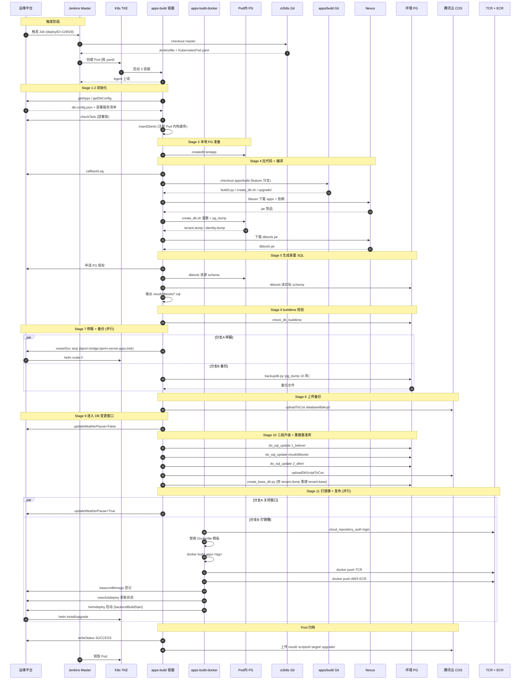
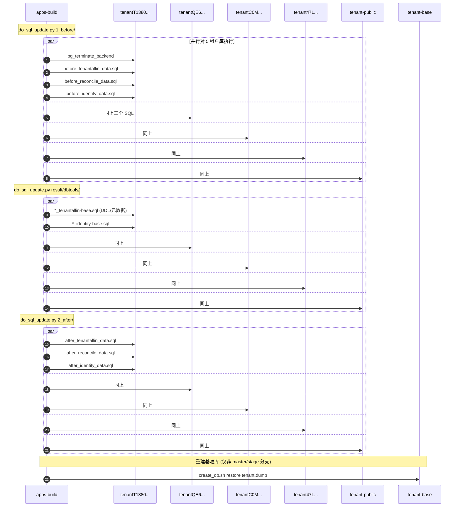
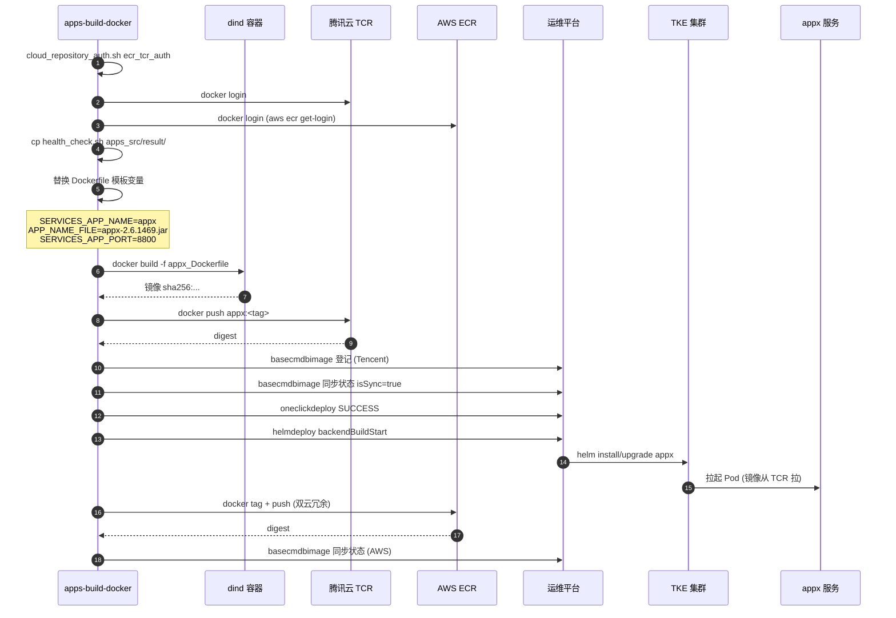
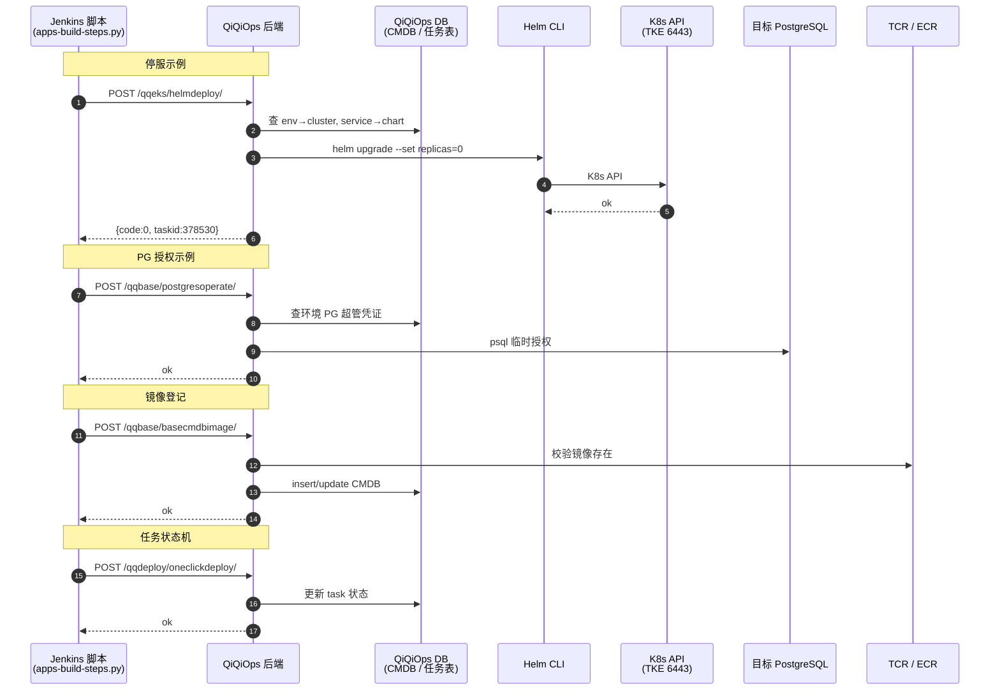
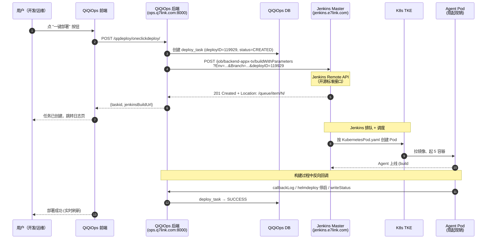
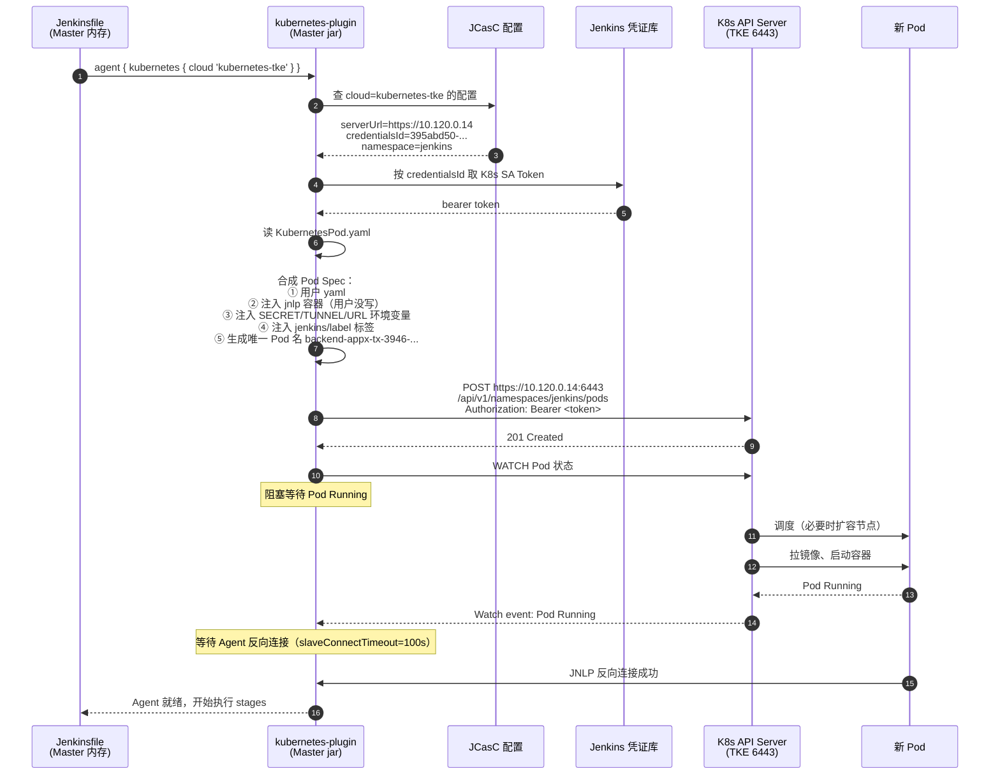
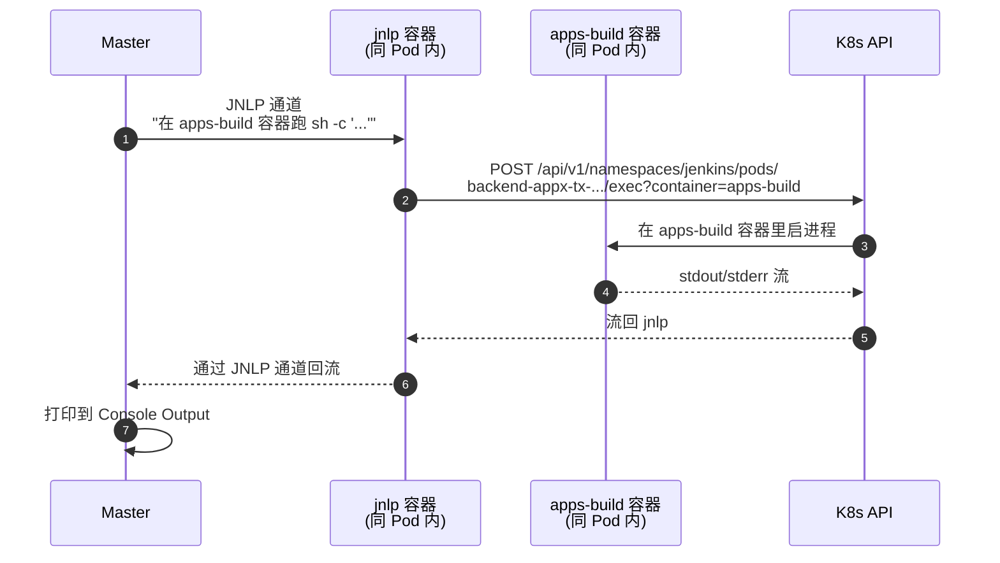

# Q7Link 后端服务 Jenkins 部署体系技术文档

> 基于 `app部署过程`（backend-appx-tx #3946，test-tx-23，feature-budget-customize 分支）与 `jenkins2k8s-master` 仓库整理。

---

## 1. 背景与定位

Q7Link 后端服务（appx/trek/bpmn-server 等）的部署，由 **Jenkins 流水线**串起以下动作：

- 起一个临时 K8s Agent Pod 在 TKE 上跑构建
- 在 Pod 内本地 PG 重新建库灌数 → 产出业务 jar + tenant.dump
- 用 dbtools 对比环境基准库，生成差量升级 SQL
- 停服 → 全库备份 → 对租户库执行 1_before / dbtools / 2_after 三段升级
- 用 tenant.dump 重建 tenant-base 基准库
- docker build 业务镜像 → 推 TCR + AWS ECR
- 回调运维平台触发 helm 拉起新服务

整套机制涉及 **三个 Git 仓库 + 一个 Jenkins 平台 + 一个运维平台**。

---

## 2. 整体架构

```
┌─────────────────────────────────────────────────────────────┐
│  运维平台 QiQiOps（ops.q7link.com:8000）                       │
│  一键部署任务、镜像 CMDB、helm 编排、PG 授权                    │
└──────────────────────────┬──────────────────────────────────┘
                           │ 触发 Job + API 回调
                           ▼
┌─────────────────────────────────────────────────────────────┐
│  Jenkins 平台（仓库：jenkins2k8s）                              │
│    - Helm 部署 Jenkins Master 2.277.1                         │
│    - JCasC 配 3 个 K8s Cloud（local / prod-AWS / tke-腾讯）    │
│    - jenkins.e7link.com，Agent 隧道 jenkins-agent.e7link.com  │
└──────────────────────────┬──────────────────────────────────┘
                           │ Pipeline from SCM → checkout
                           ▼
┌─────────────────────────────────────────────────────────────┐
│  流水线代码（仓库：ops/ci2k8s，Monorepo）                       │
│    backend-appx-tx/                                           │
│      ├── Jenkinsfile                                          │
│      ├── KubernetesPod.yaml                                   │
│      ├── Dockerfile                                           │
│      └── scripts/                                             │
│    backend-build-image-tx/scripts/                            │
│    commonModule/、cloud_repository_auth.sh                      │
└──────────────┬──────────────────────────┬────────────────────┘
               │                          │
   checkout    ▼                          ▼ HTTP
┌─────────────────────────┐    ┌──────────────────────────────┐
│ 业务构建（apps/build）    │    │ 目标环境 test-tx-23           │
│   build3.py             │    │   PG 服务器                   │
│   create_db.sh          │    │   TKE 集群（helm 拉起服务）    │
│   upgrade/1_before/     │    │   TCR + AWS ECR              │
│   upgrade/2_after/      │    └──────────────────────────────┘
└─────────────────────────┘
```

### 2.1 三层职责对照


| 层   | 仓库                   | 形态                 | 职责                                |
| --- | -------------------- | ------------------ | --------------------------------- |
| 平台层 | `jenkins2k8s`        | Helm Chart + JCasC | 部署 Jenkins、配置多 K8s Cloud、备份监控     |
| 编排层 | `ops/ci2k8s`         | Git Monorepo（无服务）  | 各 Job 的 Jenkinsfile + Pod 模板 + 脚本 |
| 构建层 | `backend/apps/build` | Python + Maven     | 拉依赖、建库、打 jar、生成 dump 与升级 SQL      |


---

## 3. Jenkins 平台（jenkins2k8s）

### 3.1 部署形态

- 来源：开源 `jenkinsci/helm-charts` chart 3.3.0
- Jenkins Core 2.277.1-jdk11
- 部署方式：Helm StatefulSet（namespace `jenkins`）
- 域名：`http://jenkins.e7link.com`
- Agent 隧道：`jenkins-agent.e7link.com:50000`
- 数据盘：200Gi PVC（Job 配置、构建历史、凭证）

### 3.2 自定义增强（相对原版）

- 镜像私有化：所有镜像推到 `620814909999.dkr.ecr.cn-northwest-1.amazonaws.com.cn/ops/...`
- 插件方式：因网络问题，插件打进自定义镜像，`installPlugins` 注释掉
- 多集群 K8s Cloud（JCasC 配置）：

  | Cloud 名           | 集群                | 用途                   |
  | ----------------- | ----------------- | -------------------- |
  | `kubernetes`      | 集群内               | 平台自身                 |
  | `kubernetes-prod` | AWS EKS           | AWS Job              |
  | `kubernetes-tke`  | TKE `10.120.0.14` | 腾讯云 Job（appx-tx 走这里） |

- 备份：CronJob 每日 21:00 备份配置到 S3 `opsbucket/jenkinsbackup/`
- 监控：`jenkins-exporter` 暴露 Prometheus 指标

### 3.3 与 ci2k8s 的衔接点

readme 中明确：新 K8s 集群接入 Jenkins 时，要执行 `**ci2k8s/init/cloudsa.yaml**` 创建 SA、`**init/init.sh**` 取 token，再更新本仓 JCasC。

---

## 4. 编排层（ci2k8s）

### 4.1 仓库定位

`ops/ci2k8s` 是一个 Git Monorepo，**不是常驻服务**。每个目录是一个 Jenkins Job 的全部配置。

Jenkins Job 配置约定：

- Definition: Pipeline script from SCM
- SCM: `ops/ci2k8s.git`，Branch `master`
- Script Path: `backend-appx-tx/Jenkinsfile`

### 4.2 顶层目录（从日志还原，约 102 项）

```
ops/ci2k8s/
├── readme.md
├── cloud_repository_auth.sh         # TCR/ECR 登录
├── commonModule/                    # Python 公共库（被各 scripts import）
├── init/                            # 新集群接入 Jenkins 初始化
├── scripts/                         # 仓级公共脚本
├── demo/
│
├── backend-appx/                    # AWS 环境 appx
├── backend-appx-tx/                 # 腾讯云 tx（本次）
├── backend-appx-private/            # 私有化
├── backend-appx-xinchuang/          # 信创
│
├── backend-build-image/             # 镜像/DB 共享脚本
├── backend-build-image-tx/          # tx 环境变体（本次用）
├── backend-build-image-private/
├── backend-build-image-xinchuang/
├── backend-build-image-version/
├── backend-build-image-version-tx/
│
├── backend-auto-build/、backend-mvn-build/、backend-mvn-test/
├── backend-cleandb/、backend-cleandb-tx/
├── backend-emergency/、backend-emergency-tx/
├── backend-build-jsf/、bpmn/、openapi/、store/、qtms/、ai-server/ …
│
├── front-trek/、front-trek-test/、front-trek-tx/
├── front-static/、front-theory/、front-authapp/ …
│
├── ops-qiqiops-backend/、ops-qiqiops-front/
├── ops-env-snapshot/、ops-es-snapshot/
├── ops-fixedtime-backup/、ops-jenkins-data-backup/
├── helm-77hub-config/、all-appliction-deploy/、sync-image/、build-image/
```

### 4.3 命名规律


| 后缀/前缀        | 含义        |
| ------------ | --------- |
| 无后缀          | AWS 默认环境  |
| `-tx`        | 腾讯云       |
| `-private`   | 私有化部署     |
| `-xinchuang` | 信创        |
| `-test`      | 测试 Job    |
| `front-*`    | 前端        |
| `backend-*`  | 后端        |
| `ops-*`      | 运维平台或环境维护 |


### 4.4 单 Job 标准结构（`backend-appx-tx/`）

```
backend-appx-tx/
├── Jenkinsfile                # 流水线主文件（12 Stage）
├── KubernetesPod.yaml         # 构建 Agent Pod 五容器规格
├── Dockerfile                 # 业务镜像模板（拷到 apps_src）
└── scripts/
    ├── apps-build-steps.py    # 核心：Module 路由
    ├── dockerbuild.py         # 打镜像 + 推送 + CMDB 回调
    └── health_check.sh        # 打进 result/，随业务镜像发布
```

`backend-build-image-tx/`：

```
backend-build-image-tx/
└── scripts/
    ├── backupdb.py            # pg_dump 全库备份
    ├── do_sql_update.py       # 多租户并行 SQL 执行
    ├── check_db_buildtime.py  # 基准库 buildtime 校验
    ├── create_base_db.py      # 用 dump 重建基准库
    └── create_db.sh           # restore dump 到环境 PG
```

---

## 5. 构建 Agent Pod（KubernetesPod.yaml）

由 `backend-appx-tx/KubernetesPod.yaml` 定义，Jenkins kubernetes-plugin 渲染后在 TKE 创建。

### 5.1 容器清单


| 容器                  | 镜像                                          | 资源           | 用途                                |
| ------------------- | ------------------------------------------- | ------------ | --------------------------------- |
| `apps-build-pgv14`  | `77hub-tcr.../ops/pg:v14`                   | 1-2C / 1-2Gi | Pod 内本地 PG（POSTGRES_PASSWORD=123） |
| `apps-build`        | `77hub-tcr.../apps_build:sqlite-334-pg14-1` | 2-3C / 8Gi   | Maven + build3.py + create_db.sh  |
| `dind`              | `77hub-tcr.../docker:stable-dind`           | privileged   | Pod 内 Docker daemon               |
| `apps-build-docker` | `77hub-tcr.../k8sdockerpush:2`              | 2-3C / 3-4Gi | docker build/push，挂 Maven 缓存 PV   |
| `jnlp`              | `inbound-agent:4.6-1`                       | 100m-500m    | Jenkins Agent 连 Master            |


### 5.2 调度与挂载

```
nodeSelector: nodegroup=ops-sa2-2xlarge
tolerations:  ops-sa2-2xlarge=1:NoSchedule

Volumes:
- workspace-volume      emptyDir            所有容器共享代码
- git-settings          ConfigMap           /opt/.git-credentials + settings.xml
- settings              ConfigMap           Maven settings.xml
- aws                   ConfigMap           ~/.aws（推 ECR）
- task-pv-storage       PVC efs-jenkins-pvc /data/.m2/repository-build（Maven 缓存）
- cache-dir / host-lib  emptyDir + hostPath dind 与 docker 容器共享
- dockercmd             hostPath            /usr/bin/docker
```

---

## 6. 流水线 Stage 全景（12 个）

按日志中 `[Pipeline] { (...)` 的真实顺序：


| #    | Stage                        | 容器                | 关键调用                                         |
| ---- | ---------------------------- | ----------------- | -------------------------------------------- |
| 0    | Declarative: Checkout SCM    | jnlp              | git clone ci2k8s                             |
| 1    | 初始化变量                        | apps-build        | `getAppx` / `getDbConfig`                    |
| 2    | 检查是否满足运行要求                   | apps-build        | `checkTask` / `insertDbinfo`                 |
| 3    | 创建 testapp 数据库               | apps-build-pgv14  | `createdb testapp`                           |
| 4    | 拉取代码/打包                      | apps-build        | checkout apps/build → `build3.py -a appx`    |
| 5    | 后台服务数据库升级脚本制作                | apps-build        | `genUpgradeScript`（dbtools diff）             |
| 6    | 基准库校验-应用 api-buildtime       | apps-build        | `check_db_buildtime.py`                      |
| 7    | 停服务 / 备份数据库（并行）              | apps-build        | `restartSvc stop` + `backupdb.py`            |
| 8    | 上传数据库备份到 COS                 | apps-build        | `uploadToCos`                                |
| 9    | 开始 DB 操作 weather_pause=False | apps-build        | `updateWeatherPause`                         |
| 10   | Tenant 库升级 / 基准库创建           | apps-build        | `do_sql_update.py` × 3 + `create_base_db.py` |
| 11   | 并行：打镜像 / 更新备份变量 / 结束 DB 操作   | apps-build-docker | `dockerbuild.py` + helm 启动                   |
| Post | Post Actions                 | apps-build        | `writeStatus` + 上传产物                         |


### 6.1 Stage 10 三段式 DB 升级（核心）

对 5 个租户库并行执行，顺序固定：

```
① do_sql_update.py  apps_src/upgrade/1_before/     ← 升级前数据
     before_tenantallin_data.sql
     before_reconcile_data.sql
     before_identity_data.sql

② do_sql_update.py  apps_src/result/dbtools/       ← 元数据/DDL 差量
     *_tenantallin-base.sql
     *_identity-base*.sql

③ do_sql_update.py  apps_src/upgrade/2_after/      ← 升级后数据
     after_tenantallin_data.sql
     after_reconcile_data.sql
     after_identity_data.sql

④ create_base_db.py + tenant.dump                  ← 重建 tenant-base
     仅 非 master/stage 分支 执行
```

### 6.2 Stage 11 镜像与发布

```
cloud_repository_auth.sh ecr_tcr_auth     # TCR + ECR 登录
cp health_check.sh apps_src/result/
python3 dockerbuild.py dockerbuild_port.json \
        20251027121055 \
        feature-budget-customize_test-tx-23-3946 \
        false test-tx-23 appx 119929

→ Dockerfile 模板替换（SERVICES_APP_NAME / APP_NAME_FILE / SERVICES_APP_PORT）
→ docker build -f appx_Dockerfile
→ docker push 77hub-tcr.../qiqi_apps/appx:<tag>
→ docker push 620814909999.dkr.ecr.../qiqi_apps/appx:<tag>
→ POST ops.q7link.com:8000/qqbase/basecmdbimage/       登记镜像
→ POST ops.q7link.com:8000/qqdeploy/oneclickdeploy/    更新 deploy 状态
→ POST ops.q7link.com:8000/qqeks/helmdeploy/           启动服务
```

### 6.3 Post 状态机

日志中出现的 FLAG 标记：


| FLAG                 | 含义              |
| -------------------- | --------------- |
| `FLAG_BACK=50`       | DB 升级完成         |
| `FLAG_BACK=99`       | 备份相关完成          |
| `UPLOAD_BACK=100`    | COS 备份已传        |
| `PUSH_IMAGES=200`    | 镜像已 push        |
| `BUILD_SERVICE=appx` | 本次构建服务          |
| `不用恢复数据库`            | 成功路径，跳过 restore |


失败路径（推断）：Post 根据 FLAG 决定是否从 COS 恢复 DB 备份。

---

## 7. 顺序图：12 个 Stage 端到端交互

### 7.1 主顺序图（全流程）




### 7.2 细节顺序图：Stage 10 多租户并行升级




### 7.3 细节顺序图：Stage 11 镜像构建与服务启动




---

## 8. QiQiOps 运维平台分层

ci2k8s 脚本里大量调用的 `ops.q7link.com:8000/qq*/` 不是 K8s 原生 API，是企企自研运维平台 **QiQiOps** 的业务 REST。

### 8.1 概念区分（容易混的几个名词）

| 概念 | 名称 | 说明 |
|------|------|------|
| 产品 / 系统名 | **QiQiOps**（企企 Ops） | 整个运维平台 |
| 部署单元 | `ops-qiqiops-backend`、`ops-qiqiops-dbup-backend`、`ops-qiqiops-front` | Helm release / Jenkins Job 角度，对应 ci2k8s 同名目录 |
| 对外入口 | `http://ops.q7link.com:8000` | 同一域名 + 端口 |
| API 模块（URL 前缀） | `/qqbase/*`、`/qqdeploy/*`、`/qqeks/*` | 业务模块路由，**不是独立服务** |

注意：`qqbase` 只是 URL 路径前缀，不要把它当成独立服务。

### 8.2 URL 前缀对应的业务领域

| 前缀 | 拼音 | 业务领域 | 典型接口 |
|------|------|---------|---------|
| `qqbase` | 企企 base | CMDB / 基础数据 | `postgresoperate/`、`basecmdbimage/` |
| `qqdeploy` | 企企 deploy | 部署任务工作流 | `oneclickdeploy/` |
| `qqeks` | 企企 eks | K8s / Helm 编排封装 | `helmdeploy/` |

> `eks` 是 AWS 的 K8s 服务名。QiQiOps 早期面向 AWS，扩展到腾讯云 TKE 后保留了前缀。

### 8.3 调用链：Jenkins 不直接碰 K8s



### 8.4 为什么不让 Jenkins 直接 kubectl

| 问题 | 直接 kubectl | 走 QiQiOps |
|------|--------------|-----------|
| 凭证 | Jenkins Pod 挂 kubeconfig，泄露风险 | Jenkins 只有 QiQiOps token |
| 多集群路由 | 脚本硬编码 `--context tke` | QiQiOps 维护 env→cluster 映射 |
| 审计 | Jenkins 日志，难追溯 | QiQiOps 写 DB，可追责 |
| Web UI | 无 | 开发自助点按钮 |
| 跨 Job 状态机 | 难做 | QiQiOps 维护 deployID 状态 |
| 危险操作 | 自由 `kubectl exec` | QiQiOps 只暴露安全业务动作 |
| 部署锁 | 难做 | `checkTask` 接口集中锁 |

### 8.5 QiQiOps 后端模块推断

基于 ci2k8s 里的 `ops-qiqiops-*` 目录和 4 个对外接口的语义：

```
QiQiOps Backend
├── CMDB 模块（qqbase）
│   ├── env_info        (test-tx-23 → cluster, PG host)
│   ├── cluster_info    (TKE 集群凭证)
│   ├── service_info    (appx → helm chart, port)
│   ├── cmdb_image      (env+service → tag 历史)
│   └── tenant_info     (tenantXXX → env 归属)
│
├── 部署任务模块（qqdeploy）
│   ├── deploy_task     (taskid 119929 = deployID)
│   ├── 状态机           CREATED → BUILDING → SUCCESS/FAIL
│   ├── 触发 Jenkins     POST /job/backend-appx-tx/build
│   └── 接收 Jenkins 回调更新状态
│
├── K8s/Helm 封装（qqeks）
│   ├── helm CLI 进程池 / Helm SDK
│   ├── values 模板渲染（helm-77hub-config 作为模板源）
│   └── K8s API client（查 Pod 状态等）
│
└── DB 操作（qqbase/postgresoperate + 独立 dbup-backend）
    ├── PG 超管凭证管理
    ├── 临时授权 / 改 pg_hba
    └── DB 升级 SQL 工单（ops-qiqiops-dbup-backend）
```

`helm-77hub-config/` 这个 ci2k8s 目录大概率是给 QiQiOps 的 Helm values 模板源（由 Jenkins Job 自动同步）。

### 8.6 三层调用关系总结

```
Jenkins 脚本（业务编排：做什么）
         │ HTTP REST
         ▼
QiQiOps（运维平台：把"做什么"翻译成"怎么做"）
         │
         ├── helm CLI ──► K8s API ──► TKE 集群
         ├── psql ──────► 目标环境 PG
         ├── docker ────► TCR / ECR
         ├── Jenkins API ◄─── 反向触发其它 Job
         └── 自家 CMDB DB
```

**K8s 原生 API 只在 QiQiOps 后端可见**；ci2k8s 流水线对外只看到 QiQiOps 的业务 REST，凭证、集群路由、状态机、审计全交给 QiQiOps。这是典型的「内部 PaaS / 应用网关」分层。

---

## 9. Agent 调度与 JNLP 执行原理

前面讲了 ci2k8s 怎么写、QiQiOps 怎么调；这一节深入到 Jenkins 内部，回答四个常见疑问：

1. 运维平台点部署后，Jenkins 怎么被触发？
2. Jenkins Master 是常驻还是临时？Agent 呢？
3. Master 怎么"知道"要创建 Agent？做了哪些事？
4. JNLP 反向连接、`container('xxx')` 这些机制到底怎么跑的？

### 9.1 触发链路：从点击部署到 Build 启动

**用户不是直接调 Jenkins，而是经 QiQiOps 中转，QiQiOps 再调 Jenkins 的标准 Remote API。**



**HTTP 请求实际内容**（QiQiOps 发的）：

```http
POST /job/backend-appx-tx/buildWithParameters HTTP/1.1
Host: jenkins.e7link.com
Authorization: Basic <base64(devops:apitoken)>
Jenkins-Crumb: <crumb>
Content-Type: application/x-www-form-urlencoded

Env=test-tx-23&Branch=feature-budget-customize&deployID=119929
```

Jenkins 立即返回：

```http
HTTP/1.1 201 Created
Location: http://jenkins.e7link.com/queue/item/45678/
```

**异步关键点**：

- Jenkins 立即返回 Queue Item URL，**不等构建完成**
- Queue Item 是排队号，**不等于** Build Number
- 出队后才分配 Build Number（日志里的 #3946）
- 真正的 Build URL 出队后才有：`http://jenkins.e7link.com/job/backend-appx-tx/3946/`

### 9.2 服务生命周期：常驻 vs 临时

```
┌─────────────────────────────────────────────────────┐
│ 一直存在（Helm 部署，重启数据不丢）                       │
├─────────────────────────────────────────────────────┤
│ Jenkins Master Pod                                  │
│   ├── /var/jenkins_home (PVC 200Gi)                 │
│   │   ├── jobs/backend-appx-tx/config.xml ← Job 定义 │
│   │   ├── jobs/backend-appx-tx/builds/3946/ ← 历史   │
│   │   ├── credentials.xml                           │
│   │   └── plugins/                                  │
│   ├── 8080 端口（HTTP API + Web UI）                  │
│   └── 50000 端口（Agent JNLP 接入）                   │
└─────────────────────────────────────────────────────┘

┌─────────────────────────────────────────────────────┐
│ 每次构建临时创建（构建完销毁）                            │
├─────────────────────────────────────────────────────┤
│ Agent Pod: backend-appx-tx-3946-7ddvq-nnn9w-8hf73   │
│   ├── jnlp 容器 (反向连 Master)                       │
│   ├── apps-build 容器 (跑业务命令)                     │
│   ├── apps-build-pgv14 容器                          │
│   ├── dind 容器                                      │
│   └── apps-build-docker 容器                         │
│                                                     │
│ 构建完：kubectl delete pod                            │
└─────────────────────────────────────────────────────┘
```

| 层 | 名称 | 生命周期 | 数量 |
|----|------|---------|------|
| 控制平面 | **Jenkins Master** | 常驻 7×24 | 1（StatefulSet） |
| 执行单元 | **Jenkins Agent Pod** | 现起现销 | 并发多少 Build 就多少个 |
| 业务进程 | 业务服务（appx 等） | 部署后常驻 | 看业务 helm release |

**Jenkins Job 配置（如 SCM、参数定义）存在 Master 的 PVC 里**（`/var/jenkins_home/jobs/backend-appx-tx/config.xml`），不在 ci2k8s 或 jenkins2k8s 仓里。这就是 jenkins2k8s 给 Master 配 200Gi PVC 的原因。

### 9.3 Master 如何决定创建 Agent

**关键：Jenkinsfile 第一行 `agent { kubernetes { ... } }` 是声明，Master 解析时触发 kubernetes-plugin。**

ci2k8s 的 Jenkinsfile 开头：

```groovy
pipeline {
    agent {
        kubernetes {
            cloud 'kubernetes-tke'                              // 用哪个 K8s 集群
            yamlFile 'backend-appx-tx/KubernetesPod.yaml'       // Pod 长什么样
        }
    }
    stages { ... }
}
```

Master 上的解析过程：

```
1. Master 收到 Build #3946 出队信号
2. lightweight checkout ci2k8s → 读 Jenkinsfile（在 Master 上）
3. Groovy 解析器解析 pipeline { ... }
4. 遇到 agent { kubernetes { ... } }
   → 这是钩子点
   → kubernetes-plugin 注册了对应的 Provider
   → "看到 kubernetes 关键字就交给我处理"
5. kubernetes-plugin 接管
6. 读 cloud 参数 → 找到 JCasC 里配的 kubernetes-tke Cloud
7. 读 yamlFile → 同样在 Master 上读 KubernetesPod.yaml
8. 准备创建 Pod
```

不同 agent 写法决定不同行为：

```groovy
agent any                              // 用任意可用 Agent
agent none                             // 不需要 Agent
agent { label 'maven' }                // 用带 maven label 的 Agent
agent { docker { image 'node:14' } }   // 用 docker 启 Agent
agent { kubernetes { ... } }           // ★ 用 K8s 起一个 Pod 当 Agent
```

**Cloud 路由**：JCasC 配的 3 个 Cloud 决定能往哪些集群起 Agent：

| Cloud 名 | 集群 | 用途 |
|---------|------|------|
| `kubernetes` | Master 自己所在集群 | 同集群任务 |
| `kubernetes-prod` | AWS EKS | AWS 环境 Job |
| `kubernetes-tke` | TKE `10.120.0.14` | 腾讯云 Job（本次） |

注意：**Master 自己跑在哪个集群** 和 **Agent Pod 起在哪个集群** 是两件事。Master 自己也是 K8s Pod（jenkins2k8s Helm 装的），但通过 Cloud 配置能调度到其它集群起 Agent。

### 9.4 Master 创建 Agent 的完整流程



**Master 自动往 Pod Spec 里塞的东西**（用户 yaml 之外）：

| 注入项 | 内容 | 作用 |
|--------|------|------|
| jnlp 容器 | `inbound-agent:4.6-1` 镜像 | 反向连 Master 接派活 |
| `JENKINS_SECRET` 环境变量 | 一次性 token | Agent 身份凭证 |
| `JENKINS_TUNNEL` | `jenkins-agent.e7link.com:50000` | Agent 连 Master 的地址 |
| `JENKINS_AGENT_NAME` | Pod 名 | Master 识别 Agent |
| `JENKINS_URL` | `http://jenkins.e7link.com/` | Master HTTP 入口 |
| `jenkins/label` 标签 | `backend-appx-tx_3946-...` | Jenkins 识别 Pod 归属哪个 Build |
| workspace-volume | emptyDir | 容器间共享代码目录 |

日志里 K8s 反馈的事件流印证：

```
[Warning][FailedScheduling] 0/6 nodes are available: 3 Insufficient cpu
[Normal][TriggeredScaleUp] pod triggered scale-up: [{asg-... 3->4}]   ← 自动扩节点
[Normal][Scheduled] Successfully assigned to 10.120.198.33
[Normal][Pulling] Pulling image "77hub-tcr.../ops/pg:v14"
[Normal][Created] Created container apps-build-pgv14
... 重复 5 次（5 个容器）...
```

这些是 **K8s 原生事件**（kubectl get events 能看到的），Jenkins 通过 Watch API 实时拿到，转发到 Console。

### 9.5 JNLP 反向连接（最核心机制）

**Agent 主动连 Master 建一根 TCP 长连接，Master 通过这根管子派活、回收结果。**

#### 9.5.1 名词澄清

| 看到的 | 其实就是 |
|--------|---------|
| JNLP | 一个 **TCP 长连接** |
| JNLP4-connect | Jenkins 自定义的协议名 |
| jenkins-agent.e7link.com:**50000** | Master 专门监听 Agent 接入的端口 |
| inbound-agent 镜像 | 跑这个 TCP 客户端的 Java 程序 |

> 历史名字坑：原始 JNLP（Java Network Launch Protocol）是 Java 从网页启动客户端的老协议。Jenkins 借了这个名字但实际跑的是自定义协议，跟原始 JNLP 没关系。

#### 9.5.2 为什么是反向连接

| 方案 | 行不通的原因 |
|------|-------------|
| Master 主动连 Agent | Agent 在 K8s 集群内 NAT 后，IP 是 10.x.x.x，Master 找不到 |
| 每次派活临时建连 | 派完一个命令就断？跑 30 分钟 build 期间得连几千次 |
| **Agent 主动连 Master（当前方案）** | Master 有固定域名 `jenkins.e7link.com:50000`，Agent 能找到 |

类比：远程外派工人，老板没工人手机号，工人到岗后主动打电话回总部，**电话不挂**，老板有事直接对话筒喊。

#### 9.5.3 连接建立过程

```mermaid
sequenceDiagram
    autonumber
    participant M as Jenkins Master<br/>(监听 50000)
    participant K as K8s API
    participant J as jnlp 容器<br/>(Pod 内)

    M->>K: 创建 Pod，注入 JENKINS_SECRET=abc123
    K->>J: Pod 起来，jnlp 容器启动
    J->>J: 容器入口自动跑<br/>java -jar agent.jar<br/>  -url http://jenkins.e7link.com<br/>  -tunnel jenkins-agent.e7link.com:50000<br/>  -secret abc123<br/>  -name backend-appx-tx-3946-...
    J->>M: TCP 三次握手 (50000 端口)
    J->>M: 发"我是 backend-appx-tx-3946-..."<br/>secret=abc123
    M->>M: 校验 secret 通过
    M-->>J: 握手成功，通道建立
    Note over M,J: 此后这根 TCP 连接全程不断<br/>直到 Pod 销毁
```



**关键点**：

- **JENKINS_SECRET** 是 Master 创建 Pod 时塞进去的"工牌"，每个 Pod 唯一，构建结束作废
- 端口 50000 是 Master 专门为 Agent 接入开的（HTTP 在 8080）
- 协议 JNLP4-connect 本身加密

日志里能看到握手成功：

```
JNLP4-connect connection from ip-10-120-198-33.cn-northwest-1.compute.internal/10.120.198.33:51616
```

#### 9.5.4 通道上跑什么

**像电话**，双向：

```
Master → Agent：去 apps-build 容器，跑命令 "python build3.py -a appx"
Agent → Master：收到，开始跑了
Agent → Master：stdout: "build apps = ['appx']"
Agent → Master：stdout: "downloading appx..."
Agent → Master：（持续传输 21 分钟的所有输出）
Agent → Master：命令结束，退出码 0
```

通道不挂的好处：Master 持续知道 Agent 还活着、Pipeline 几十个 `sh` 步骤共用这一根连接、不用反复握手。

### 9.6 `container('xxx')` 的执行机制

Pipeline 里写：

```groovy
container('apps-build') {
    sh 'python build3.py -a appx'
}
```

底层实际流程：



**核心机制**：

1. jnlp 容器和 apps-build 容器**在同一个 Pod 里**，共享 workspace 卷
2. jnlp 容器里跑的 Java 程序有 K8s API 调用权限（用 Pod 的 ServiceAccount）
3. 它去调 K8s API 的 **exec 接口**（等价 `kubectl exec --container=apps-build`）
4. exec 接口在目标容器里启进程
5. stdout/stderr 双向流回

日志里有这条 warning 印证：

```
Warning: JENKINS-30600: special launcher 
  org.csanchez.jenkins.plugins.kubernetes.pipeline.ContainerExecDecorator$1@...
  decorates RemoteLauncher[hudson.remoting.Channel@...:
  JNLP4-connect connection from ip-10-120-198-33...]
```

**`ContainerExecDecorator`** 就是 `container('xxx')` 的实现类——它"装饰"默认的执行器，把命令路由到指定容器。

### 9.7 Agent 本质：5 容器中谁才是真正的 Agent

**Agent 不是 Jenkins 服务**，是一个普通 Java 客户端进程。

| 维度 | Jenkins Master | Jenkins Agent |
|------|---------------|---------------|
| 是不是 Jenkins | 是（Web UI + Job 管理） | **不是**，只是 Java 客户端 |
| 镜像 | `jenkins/jenkins:2.277.1-jdk11` | `jenkins/inbound-agent:4.6-1` |
| 入口程序 | `jenkins.war`（Web 应用） | `agent.jar`（一个客户端） |
| 端口 | 8080 + 50000 | 不监听端口 |
| 状态存储 | `/var/jenkins_home` (200Gi PVC) | 无（emptyDir） |
| 生命周期 | 7×24 常驻 | 单次构建（销毁） |

**严格说：Agent = jnlp 容器**，其他 4 个是"工作容器"，由 jnlp 通过 K8s exec API 派活进去执行命令。整个 Pod 一起销毁。

```
Agent Pod (backend-appx-tx-3946-...)
├── jnlp                ← Agent 本体（连 Master，转发命令）
├── apps-build          ← 工作容器（Maven、build3.py）
├── apps-build-pgv14    ← 工作容器（本地 PG）
├── dind                ← 工作容器（Docker daemon）
└── apps-build-docker   ← 工作容器（docker build/push）
```

### 9.8 一图统揽完整数据流

```
QiQiOps 点部署
   │ HTTP POST /qqdeploy/oneclickdeploy/
   ▼
QiQiOps 后端
   │ HTTP POST /job/backend-appx-tx/buildWithParameters
   ▼
Jenkins Master（常驻在自己集群）
   │ 解析 Jenkinsfile，识别 agent { kubernetes { cloud 'kubernetes-tke' } }
   ▼
kubernetes-plugin
   │ 拿 JCasC 配的 TKE 集群凭证
   │ 合成 Pod Spec（用户 yaml + 自动注入 jnlp + SECRET）
   ▼
TKE K8s API (https://10.120.0.14:6443)
   │ POST /api/v1/namespaces/jenkins/pods
   ▼
TKE 集群调度（必要时扩容节点）
   │ 拉镜像、启动 5 容器
   ▼
Agent Pod 跑起来
   │ jnlp 容器自动启动 agent.jar
   │ agent.jar 反向连 jenkins-agent.e7link.com:50000
   ▼
Master ←──长连接(JNLP)──→ Agent
   │
   ▼
Master 通过这条连接派活
   │ "在 apps-build 容器跑 python build3.py"
   ▼
jnlp 容器调本 Pod 的 K8s API exec apps-build 容器
   │
   ▼
命令执行，stdout 回流 Master
```

### 9.9 常见疑问速查

| 问题 | 答案 |
|------|------|
| 如果 Master 重启，正在跑的构建会咋样？ | 大概率失败。Queue 部分持久化，但活跃 Build 会丢 JNLP 连接 |
| Agent Pod 怎么知道要跑哪些命令？ | 不知道。Pipeline 步骤是 Master 一步步通过 JNLP 推过来的 |
| `container('xxx')` 是 K8s 概念吗？ | 不是。是 kubernetes-plugin 的 Pipeline DSL，底层翻译成 kubectl exec |
| 触发 Build 必须 Token 吗？ | 是。QiQiOps 用 Jenkins API Token + Crumb 防 CSRF |
| Pod 起不来怎么办？ | Jenkins 默认等 100s，超时把 Queue Item 标失败 |
| 多 Job 同时排队会怎样？ | 各起各的 Pod，互不影响，TKE 不够节点自动 ASG 扩容 |
| Job 定义改了在哪生效？ | Jenkins UI 改 → 存 Master PVC config.xml → 下次 Build 立即生效 |
| Agent 跑在哪个集群？ | JCasC Cloud 指定的集群（本次是 TKE），**不一定**是 Master 自己所在集群 |

---

## 10. 核心脚本：`apps-build-steps.py`

设计模式：**一个 Python 文件 + `--Module=<name>` 子命令**，避免在 Jenkinsfile 里堆 shell。

### 10.1 Module 清单（日志确认）


| Module                | 入参                                              | 作用                       | 外部依赖                   |
| --------------------- | ----------------------------------------------- | ------------------------ | ---------------------- |
| `getAppx`             | Env                                             | 解析本次部署 mono 服务           | 运维平台                   |
| `getDbConfig`         | Env                                             | 拉环境 DB 连接 → 写本地 json     | 运维平台                   |
| `checkTask`           | Env, Branch                                     | 部署锁，防并发                  | 运维平台                   |
| `insertDbinfo`        | DBfiles, DBName, DBHost, DBPort, DBUser, DBPswd | 注册 Pod 内构建库              | 本地 json                |
| `callbackLog`         | Env, deployID, log_info                         | 回传阶段日志                   | 运维平台                   |
| `getBuildPort`        | Env                                             | 生成 dockerbuild_port.json | 配置表                    |
| `genUpgradeScript`    | DBfiles, DbtoolsPath, BUILD_DB_NAME             | dbtools 生成差量 SQL         | 运维 PG 授权 + dbtools jar |
| `restartSvc`          | Svclist, Operate                                | helm 停/启服务               | `qqeks/helmdeploy`     |
| `uploadToCos`         | localPath, cosfilePath, isSubCompress           | 上传 COS                   | 腾讯云 COS                |
| `uploadDbScriptToCos` | localPath, cosfilePath                          | 升级 SQL 归档                | COS                    |
| `updateWeatherPause`  | deployID, weather_pause                         | DB 变更窗口 open/close       | 运维 deploy 任务           |
| `writeStatus`         | deployID, buildID, buildTime, taskStatus        | 写最终状态                    | 运维平台                   |


### 10.2 运维平台 API


| 接口                         | 用途                                 |
| -------------------------- | ---------------------------------- |
| `qqbase/postgresoperate/`  | PG 操作授权                            |
| `qqbase/basecmdbimage/`    | 镜像 CMDB 登记 + 云平台同步状态               |
| `qqdeploy/oneclickdeploy/` | 一键部署任务状态                           |
| `qqeks/helmdeploy/`        | 停/启服务，`byCaller=backendBuildStart` |


---

## 11. 业务构建（apps/build）

由 Stage 4 单独 checkout，路径 `apps_src/`，分支与 Jenkins 参数 `Branch` 一致。

### 11.1 目录结构（日志可见）

```
apps_src/
├── config.yaml                # 各 app 版本清单
├── build3.py                  # 主入口
├── build3_app.py / build3_dump.py
├── create_db.sh               # Pod 内 PG 建库 + 灌数 + 导 dump
├── create_db_parallel.sh / create_db_ops.sh
├── dbtools.sh                 # 下载 dbtools jar
├── syncmeta.xml
├── multi-langs-merge.xml
├── Dockerfile                 # 从 ci2k8s 拷入
├── upgrade/
│   ├── 1_before/  (before_*.sql)
│   └── 2_after/   (after_*.sql)
├── scripts4/                  # 附加脚本
├── target/                    # build3 中间产物
└── result/
    ├── appx-2.6.1469.jar
    ├── tenant.dump
    ├── identity.dump
    ├── health_check.sh
    └── dbtools/
        ├── dbtools-1.3.0-SNAPSHOT.jar
        ├── db-config.json
        ├── *_to_test-tx-23.tenantallin-base.sql
        └── *_identity_to_*identity-base*.sql
```

### 11.2 `build3.py -a appx` 主要动作

1. 读 `config.yaml`，校验依赖版本
2. Maven 下载 `appx:2.6.1469` 及所有 enterprise-app 依赖
3. 打包 `result/appx-2.6.1469.jar`
4. 准备 init-data、string-res、front-init-data
5. `create_db.sh -d tenant -a "baseapp project contract …"` → `result/tenant.dump`
6. `create_db.sh -d identity -a "identity"` → `result/identity.dump`
7. mvn process-resources 合并多语 CSV

耗时约 21 分钟，瓶颈在 Maven 下载与本地建库灌数。

---

## 12. db-config.json：贯穿全流程的配置中枢

由 `getDbConfig` + `insertDbinfo` 在 Stage 1-2 生成：

```json
{
  "apps-build_test-tx-23_feature-budget-customize_3946_20251027121053": {
    "host": "localhost", "port": "5432", "user": "postgres", "pass": "123"
  },
  "test-tx-23": {
    "host": "postgres.test-tx-23.e7link.com",
    "port": "5432",
    "user": "postgres",
    "pass": "...",
    "superDbUser": "postgres",
    "superDbPasswd": "...",
    "dbList": [
      "tenantT1380D63H890040", "tenantQE6PSQ50GAU0001",
      "tenantC0MQEQ505P70001", "tenant47L0LP505840001", "tenant-public",
      "tenant-base", "identity", "identity-base", "camunda", "langflow"
    ]
  }
}
```

两类 key 分工：


| key            | 指向                 | 用途                           |
| -------------- | ------------------ | ---------------------------- |
| `apps-build_*` | Pod 内 localhost PG | build3 建库 + dbtools 生成差量 SQL |
| `test-tx-23`   | 环境 PG 服务器          | 备份、升级租户库、重建 tenant-base      |


dbtools 对比时引用逻辑库名：

- 源：`apps-build_...tenant` / `apps-build_...identity`
- 目标：`test-tx-23.tenant-base` / `test-tx-23.identity-base`

---

## 13. 产物与归档

### 13.1 运行时产物


| 路径                                       | 说明         |
| ---------------------------------------- | ---------- |
| `apps_src/result/appx-*.jar`             | 业务 jar     |
| `apps_src/result/tenant.dump`            | 基准库 dump   |
| `apps_src/result/dbtools/*.sql`          | 差量升级 SQL   |
| `apps_src/upgrade/1_before/`、`2_after/`  | 手工升级 SQL   |
| `/data/database_backup/backend-appx-tx/` | pg_dump 备份 |
| `dockerbuild_port.json`                  | 各服务端口映射    |
| `postgres.*.json`                        | DB 连接配置    |


### 13.2 COS 归档路径


| 类型    | COS 路径                                                |
| ----- | ----------------------------------------------------- |
| DB 备份 | `databaseBakup/<env>_<buildID>_<buildTime>/`          |
| 升级脚本  | `offline_tenant_db_upgrade_script/<env>/<buildTime>/` |
| 构建产物  | `appsBuild/<branch>/<env>/<buildTime>/`               |


### 13.3 镜像

```
77hub-tcr.tencentcloudcr.com/qiqi_apps/<service>:<branch>_<env>-<buildID>-<buildTime>
620814909999.dkr.ecr.cn-northwest-1.amazonaws.com.cn/qiqi_apps/<service>:<同 tag>
```

---

## 14. 完整时间线（本次构建）


| 时刻           | 事件                                   | 耗时    |
| ------------ | ------------------------------------ | ----- |
| 12:10        | Pod 拉起，5 个容器启动 + checkout ci2k8s     | ~30s  |
| 12:11        | Stage 1-3 初始化 + checkout apps/build  | 1min  |
| 12:11~12:33  | Stage 4 build3.py（Maven + 本地建库灌数）    | 21min |
| 12:33~12:35  | Stage 5 dbtools 生成差量 SQL             | 2min  |
| 12:35~12:36  | Stage 7 停服 + 备份 10 库                 | 1min  |
| 12:36~12:45  | Stage 8 上传备份 COS                     | 9min  |
| 12:45~12:46  | Stage 10 三轮 SQL 升级 + 重建 tenant-base  | 1min  |
| 12:46~12:50+ | Stage 11 docker build/push + helm 启动 | 4min  |
| ~12:55       | Post：上传产物，SUCCESS                    | -     |


---

## 15. 关键设计要点

### 15.1 为什么 Pod 内带 PG

- 不污染目标环境：先在 Pod 本地建一份「目标版本」的完整 schema + 灌数
- dbtools 用这个本地库作为「源」，与环境基准库做 diff，得到精确的差量 SQL
- 副产物 `tenant.dump` 直接拿去 restore 环境基准库

### 15.2 为什么不用 Maven 直接打镜像

- 业务编译时间长（21 分钟），与镜像构建解耦
- `apps_src/result/` 同时被 dbtools、docker、COS 归档复用
- 编译产物可独立归档复盘

### 15.3 为什么 ci2k8s 是 Monorepo

- 多环境（aws/tx/private/xinchuang）通过目录复制变体，避免分支管理
- 公共脚本（`commonModule/`、`cloud_repository_auth.sh`）一仓共享
- Jenkins UI 上每个 Job 指向同仓不同目录，凭证、SCM 设置可继承

### 15.4 为什么主流程靠 HTTP 调运维平台

- ci2k8s 不持有 helm/kubectl 凭证，所有环境操作走运维平台 API
- 运维平台维护「环境→集群→Helm Values」的映射，Jenkins 只关心「发命令」
- deployID 贯穿全程，便于运维平台关联 Jenkins 构建日志

---

## 16. 排查与扩展路径


| 需求                      | 改哪                                                                        |
| ----------------------- | ------------------------------------------------------------------------- |
| 改流水线 Stage 顺序           | `ci2k8s/backend-appx-tx/Jenkinsfile`                                      |
| 改 Agent Pod 资源/镜像       | `ci2k8s/backend-appx-tx/KubernetesPod.yaml`                               |
| 改停服列表 / COS 路径 / API 调用 | `ci2k8s/backend-appx-tx/scripts/apps-build-steps.py`                      |
| 改镜像构建逻辑                 | `ci2k8s/backend-appx-tx/scripts/dockerbuild.py`                           |
| 改 DB 升级执行方式             | `ci2k8s/backend-build-image-tx/scripts/do_sql_update.py`                  |
| 改备份策略                   | `ci2k8s/backend-build-image-tx/scripts/backupdb.py`                       |
| 新增 upgrade SQL          | `apps/build/upgrade/1_before/` 或 `2_after/`                               |
| 改业务编译流程                 | `apps/build/build3.py`                                                    |
| 改业务 jar 版本              | `apps/build/config.yaml`                                                  |
| 改业务镜像基础环境               | `ci2k8s/backend-appx-tx/Dockerfile`                                       |
| 新增环境（如 -hw 华为云）         | 复制 `backend-appx-tx/` → `backend-appx-hw/`，改 JCasC 加 Cloud                |
| 改 Jenkins 平台本身          | `jenkins2k8s/jenkins/values.yaml`、`jenkins-jenkins-jcasc-config-tke.yaml` |


---

## 17. 名词与缩写


| 术语              | 说明                            |
| --------------- | ----------------------------- |
| `appx`          | Q7Link 后端 mono 服务，本次部署目标      |
| `tenant-base`   | 环境级基准库，每次 build 完会重建          |
| `tenantXXX`     | 实际租户库，多个并行升级                  |
| `dbtools`       | Q7Link 自研 SQL diff 工具（jar 形式） |
| `init-data`     | 各 app 的预置数据                   |
| `deployID`      | 运维平台一键部署任务 ID（本次 119929）      |
| `buildID`       | Jenkins 构建号（本次 3946）          |
| `buildTime`     | 触发时刻时间戳（本次 20251027121055）    |
| `weather_pause` | 标记 DB 是否处于变更窗口                |
| `FLAG_BACK`     | Post 阶段进度检查点                  |
| `JCasC`         | Jenkins Configuration as Code |
| `TKE`           | 腾讯云 K8s 服务                    |
| `TCR`           | 腾讯云镜像仓库                       |
| `ECR`           | AWS 镜像仓库                      |


---

## 18. 仓库获取建议

当前未持有 `ops/ci2k8s` 仓库（内网无访问权限）。如需深入排查，按优先级向运维申请：

1. `backend-appx-tx/Jenkinsfile`
2. `backend-appx-tx/scripts/apps-build-steps.py`
3. `backend-appx-tx/KubernetesPod.yaml`
4. `backend-build-image-tx/scripts/do_sql_update.py`
5. `commonModule/`（公共 Python 库）

`apps/build` 仓库同样需要单独申请。

---

文档结束。